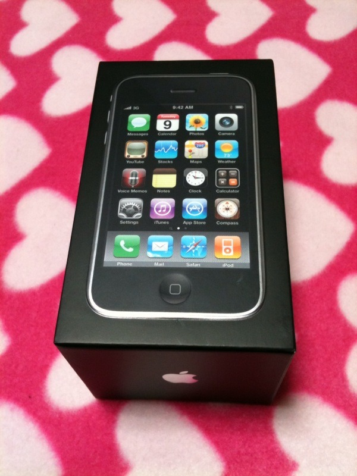
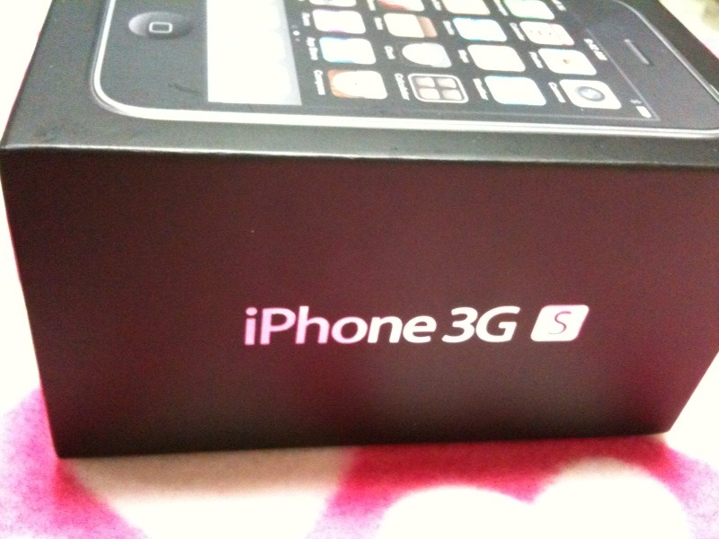
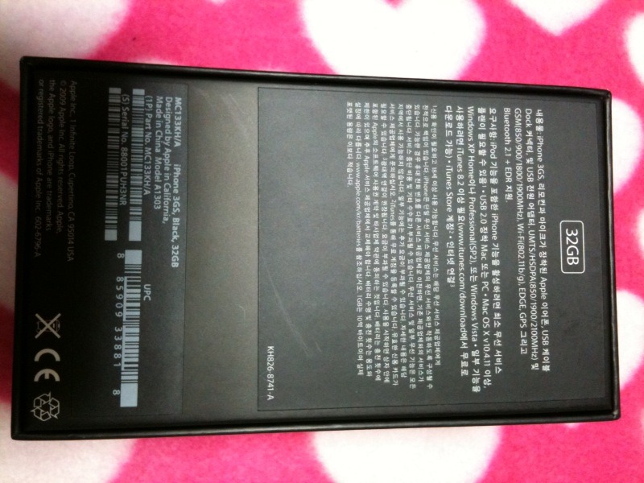

드디어 3달을 지켜보던 아이폰을 구입했다. 와이프가 사준 생일 선물 ^^;
이런저런 이유로 휴대폰을 2개 쓰게 되었지만, 아무래도 IT 트렌드를 따라가면서 아이디어 고민도 좀 해보고, 여기저기서 유용하게 쓰일 거 같다.

 KT 직영점에서 구입했는데, 친절하게도 액정 안에 먼지가 있는지 확인하라고 하셔서 먼지가 있는 것을 5번이나 발견하여 5번이나 새 제품을 뜯었다. ㅋㅋ 6번을 뜯어서 제일 깔끔한것으로 고르고(그래도 직원분이 끝까지 친절하셔서 정말 멋지셨음).
 아마 주로 안드로이드 프로그래밍을 하겠지만, 뭐가 아직 안되는지, 어떤게 불편한지를 체크해서 apps 를 만들도록 해봐야겠다.
 2시간정도 앱 스토어를 돌아다녀본 결과. 왠만한 유료 어플들은 곧 비슷한 무료 어플들이 나와버리는거 같고, 게임과 같이, 컨텐츠를 가지거나 경쟁력이 있는 게 아니라, 간단한 아이디어 프로그램을 유료로 팔아서 지속적으로 돈벌기가 꽤 힘들겠다는 것. 그래서 무료이면서 광고를 넣는게 꽤 괜찮은것 같다.
 당장은 pop.wimy.com 이 어떻게든 최선의 방법으로 flash 가 안되는 아이폰에서 제공가능한 방법을 찾는것. 그리고 매우 간단한 아이폰 어플을 짜보는것.
ps : 구입 후 조금 아쉬운 건 마음대로 파일을 못 넣는다는것. pdf 파일들을 좀 집어넣어서, pdf viewer 같은 것으로 책을 보거나 텍스트 파일을 보고 싶었는데 안되는 것 같다. google docs 를 이용하면 되긴 하지만 꽤 의외였음.

첨부파일: <a href="tiffany-1">tiffany-1</a> <a href="tiffany-2">tiffany-2</a> 