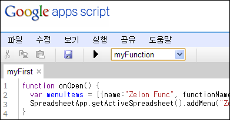
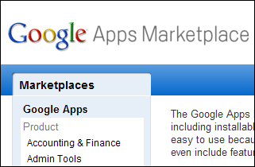

구글 문서 포스팅 : <http://googledocs.blogspot.com/2010/03/apps-script-gallery-for-google.html>
따라하기 설명서 : <http://www.google.com/google-d-s/scripts/articles.html>

 구글 문서에 스크립트 기능이 추가되었습니다. 간단히 생각해서 엑셀의 매크로나 Add-in 기능이 들어왔다고 생각하면 되겠습니다. 구글 문서가 정말 더욱더 좋아지는군요.

 셀의 정보(입력값, 데이터등)을 읽어와서 프로그래머가 원하는 작업을 하고, 셀에 쓰는 기능만 되면 정말 여러가지의 일을 할 수 있을 듯 합니다.

 하지만, 프로그래머라면 역시 'Hello world!' 를 찍어봐야 합니다. ㅋㅋ 아래의 코드를 통하면 매우 간단합니다.

> function myFunction()
> {
>   Browser.msgBox("Hello world!!");
> }

------------------------------------------------------------------------

 이와 함께 구글에서는 구글 Apps Marketplace 를 오픈했습니다(<http://googleblog.blogspot.com/2010/03/open-for-business-google-apps.html>)

 Google Apps 를 위해 사용자가 만든 Apps를 위한 오픈마켓을 만든겁니다.

 간단히 하나의 App를 둘러보면, Archiver 라는 App 은 Google App 의 문서들을 백업하고 복구시키는 기능을 합니다. 만약 저처럼 wimy.com 을 Google App 에 등록해놓고 쓰거나, 외국의 학교나 관공서처럼 Google App 를 이용하는 곳에서는 저 App 를 구입 후 혹시나 모를 일을 위해서 백업이나 복구가 가능합니다.

 재미있는 것은 라이센스입니다.

****
> **Pricing details**
> $5 per user 
> FREE to Education and non-profit

 라고 되어있습니다. 쉽게 생각하면 '개인사용자는 무료이지만, 기업 사용자는 **사용자당** 5달러(!!!!)입니다.' 저런 가격 정책이 Google App 의 정보에 기반해서 결재가 된다면 생각보다 꽤 파급력있는 시장이 될지도 모릅니다. Google Apps 를 도입한 곳은 꽤 있다고 알려져있습니다.

 앞으로 어떤 세상이 열릴지 두근두근합니다.

