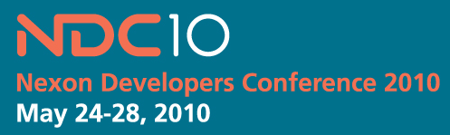

 게임 개발을 그만둔지 3년째에 접어들지만, 역시 프로그래머라면 정말 재미있는 일 중의 하나가 게임 개발이라고 생각한다.
 [넥슨 개발자 컨퍼런스](http://ndc.nexon.com/ "[http://ndc.nexon.com/]로 이동합니다.")는 우리나라의 대표 게임개발회사 중 하나인 넥슨에서 주최하는 컨퍼런스로 2010년에는 많은 세션이 공개로 진행되었다. 간단히 검색해보면([구글에서 검색](http://www.google.co.kr/search?hl=&q=%EB%84%A5%EC%8A%A8+%EA%B0%9C%EB%B0%9C%EC%9E%90+%EC%BB%A8%ED%8D%BC%EB%9F%B0%EC%8A%A4&sourceid=navclient-ff&rlz=1B3GGLL_koKR378KR382&ie=UTF-8 "[http://www.google.co.kr/search?hl=&q=%EB%84%A5%EC%8A%A8+%EA%B0%9C%EB%B0%9C%EC%9E%90+%EC%BB%A8%ED%8D%BC%EB%9F%B0%EC%8A%A4&sourceid=navclient-ff&rlz=1B3GGLL_koKR378KR382&ie=UTF-8]로 이동합니다.")) 상당히 많은 세션들을 볼 수 있는데, 게임 프로그래머가 아닌 일반(?) 프로그래머들도 볼만한 세션들이 많이 있다.
ndc2010 모음 : <http://gamemook.com/entry/NDC-SLIDE-LIST>
 우리나라에 이정도 퀄리티의 공개(일부긴 하지만;;) 프로그래밍 컨퍼런스가 매년 열린다는 게 무척이나 감동적이다 ㅠㅜ
 프로그래머라면 꼭 한번씩 훑어보길~~
ps : 게임 기획자, 운영자에 관한 내용들도 좀 있다 ㅋ

