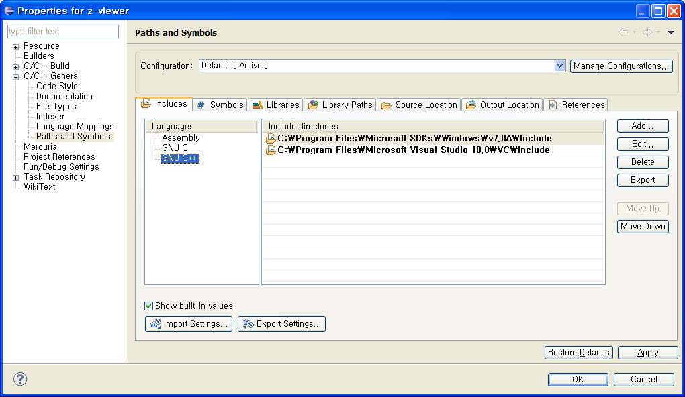

eclipse 에서 visual studio 에서 사용하는 mfc나, win32 등을 편리하게 편집하려면, 특정 헤더 파일들의 경로를 지정해줘야 제대로 eclipse CDT  의 기능을 사용할 수 있다(intelisense, syntax highlighting등등).

Project 의 Properties 를 열어서, 아래와 같이 path 를 설정해준다.

path 설정을 한 후에는 Project 의 Index -&gt; Rebuild 를 한번 해서 다시 indexing 하도록 해주자.
 eclipse CDT 는 상당히 잘 찾아준다. :)

