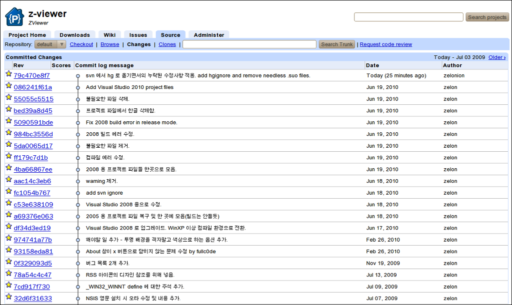

[2010/06/22 - \[개발관련/오픈소스\] - ZViewer 의 소스를 구글 코드로 이전하였습니다.](http://blog.wimy.com/321)
위의 글에서 뭔가 찜찜함을 느끼고, kldp.net 에서 code.google.com 으로 소스를 제대로 이전하였습니다. 드디어 svn(subversion) 의 코드 변경 히스토리를 모두 code.google.com 의 hg(mercurial)로 옮겼습니다.

 옮기는 방법을 이리저리 알아보던 중...... 결국 구글코드에서 제공하는 방법(난 왜 헤맨건지 -\_-)이 제대로 되었습니다[\[링크\]](http://code.google.com/p/support/wiki/ConvertingSvnToHg "[http://code.google.com/p/support/wiki/ConvertingSvnToHg]로 이동합니다.") 

 다만 이 방법이 리눅스 환경의 유틸리티들을 주로 이용하는 것이라서 리눅스를 사용할 수 있는 환경인 집의 컴퓨터(-\_-)에서 해야해서 적용하는데 시간이 좀 걸렸네요;; 참고로 현재 제 환경은 우분투 10.04 입니다. 그리고 역시 (모든것이 그렇듯이;;;) 매뉴얼대로 한번에 싹 되지는 않더군요. 그래서 나름 정리해보고자 합니다.

 간략히 과정을 적어보면 아래와 같습니다.

<table>
<tbody>
<tr class="odd">
<td> 1. 툴 설치 
sudo aptitude install swig-python hg svn python-svn 
(위의 툴 중에 빠졌을지도 모르는건 위의 원본 링크 참조;;) 우분투 10.04 에서는 위처럼 설치하면 버젼은 모두 만족합니다. 
 
2. 환경 설정 
~/.hgrc 를 열거나 없으면 새로 만들어서 아래 2줄을 넣고 저장합니다.( = 다음에는 아무것도 없는게 맞습니다) hg convert 기능을 활성화하는 과정입니다. 
 
[extensions] 
hgext.convert= 
 
~/.subversion/servers 파일을 열어서 아래처럼 [global] 중에서 아래 2줄을 주석을 제거하고 yes 로 합니다. 암호를 저장하는 기능을 켭니다. 
 
[global] 
... 
... 
store-passwords = yes 
store-plaintext-passwords = yes 
 
참고로 위의 svn 설정 파일 부분은 구글 코드에는 없는 내용인데, kldp.net 의 문제인지, 제 리눅스의 문제인지 이상하게 바로 kldp.net 의 암호를 넣으니 않되어서 svn checkout 으로 한번 kldp.net 에 접속해서 암호를 저장해놓은 다음에 아래의 3번을 진행해야하더군요.(kldp.net 이 아닌 다른 svn 서버는 아마 이 과정이 없어도 될거 같긴 합니다) 
 
3. svn 을 hg 로 변환해서 받아오기 
 
mkdir hg-client 
hg convert http://kldp.net/svn/zviewer/trunk 
 
참고로 위의 작업을 하는 도중 kldp.net 의 접속이 몇번 끊어졌었는데, 그냥 다시 hg convert 줄을 다시 실행하면,작업하던 곳에서부터 다시 이어서 해줍니다(참으로 다행입니다 ㅋㅋ) 
 
4. hg 를 구글 코드에 올리기 
 
cd hg-client 
hg push https://z-viewer.googlecode.com/hg 
 
 
완료!! 
</td>
</tr>
</tbody>
</table>

이제 정말 찜찜함없이 zviewer 작업을 구글 코드에서 작업할 수 있게 되었네요. 늘 그렇듯이... 언제 다음 버젼 릴리즈할지는 모르겠지만 ^^;;

