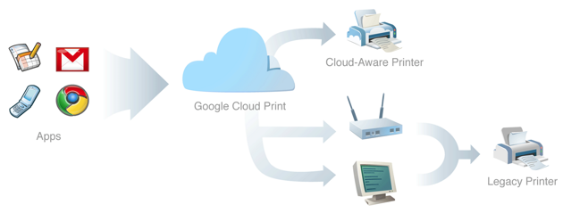

<http://googlesystem.blogspot.com/2010/12/google-cloud-print-now-available.html>
<http://code.google.com/intl/ko-KR/apis/cloudprint/docs/overview.html>

구글에서 클라우드 프린터 기능을 체험해볼 수 있게 했다. 크롬의 카나리 버젼을 쓰고, 설정에서 해당 기능을 켜면, 어디서나 내가 등록한 프린터에 출력할 수 있게 해주는 기능이다.

쉽게 생각해서, 내 프린터를 구글 클라우드 프린터 서비스에 등록해놓고, 언제나, 어디서나, 어떤 장치를 통해서나 이 구글 클라우드 프린터 서비스에 'xxx 를 프린트해줘' 라고 하면, 등록된 프린터에 이 내용을 전송해서 프린트하게 해주는 서비스이다.

 게다가 내 프린터를 구글 계정 공유(구글 문서를 공유하듯이)를 통해서 다른 사람에게 공유가 가능하다. 복잡한 드라이브 설치나, 프린터 공유가 필요하지 않다는 것도 꽤 매력적이다.

 내 생각에는 이전에 출력한 내용보기라던지, 특정 RSS 내용을 아침에 자동으로 출력하게 해주는 웹 서비스(!!! 웹 어플이라는게 중요 !!!) - 아침에 신문이 배달되듯이 뉴스가 배달되는 느낌으로 - 가 나온다던지, 더욱 다양한 웹 서비스들이 나올 기반을 마련해 줄 것 같다.

느낌은 꽤 괜찮다~ 하지만 일단 아직 제대로 나오지 않은 기능이고(현재는 테스트 페이지만 출력가능하다), 이 구글 클라우드 프린터를 직접지원해주는 프린터(즉, 컴퓨터를 거치지 않고, 랜선만 꼽으면 이런 동작을 해주는 프린터)가 나와야 정말 제대로 된 맛보기가 가능할 듯 싶다. 그리고 직접 사용해보면 좀 더 재미있는 기능들이 자꾸 생겨나지 않을까 싶다.

 여튼 기대기대~

ps : 또 하나 재미있는게, 구글에서는 '종이 프린팅' 은 구시대의 유물로 생각하고, 모든 걸 웹 상에서 보여주고, 저장하고 그럴것 같았는데, '프린팅해서 직접 들고 보는' 것을 무시할 수는 없었다는 생각이 든다. 아니면, '아날로그' 를 사람들이 꽤 좋아한다는 것을 알아서이려나?...
