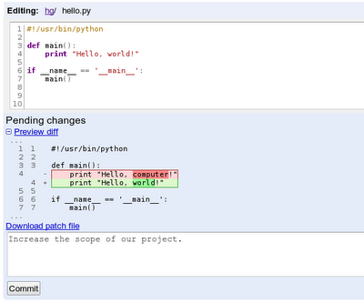

<http://googlecode.blogspot.com/2011/01/make-quick-fixes-quicker-on-google.html>

이제 웹브라우저에서 바로 코드를 수정할 수 있게 되었습니다. 구글... 역시 장난이 아닙니다 -0-;; 이제 IDE 를 웹 브라우저 안에서 볼지도... 그럼 크롬 OS 에서 개발도 가능하게 되겠네요...... 먼저 google app engine 에 적용이 될 거 같고, 웹에서 코드를 수정하여 바로 웹으로 실행시켜보는.... +\_+ 완전 멋집니다.

웹 브라우저안에서 대동단결이 프로그래머에게는 먼 얘기인 것만 같았는데, 멀지 않은 것 같습니다.

재미있는 점은 만약 코드에 직접 패치가 불가능한 사람이 코드 수정을 할 경우에는 수정 내역을 바로 패치 파일로 만들어 코드 관리자에게 보낼 수 있다는 겁니다. 코드 제안이 훨씬 손쉬워져서 오픈소스가 좀 더 활발하게 될 계기가 될 것 같습니다.

 끊임없는 발전을 보면 역시 멋집니다. sf.net 은 어떻게 되려는지....;;
