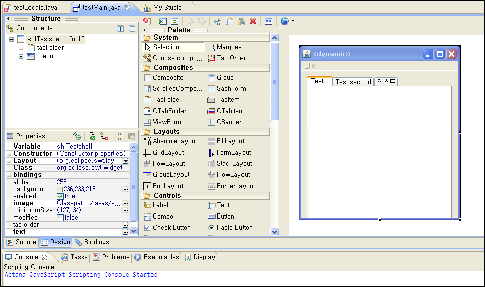

<http://code.google.com/javadevtools/wbpro/>

 정말 멋지다. 솔직히 C\#을 더 자주 쓴 이유가 GUI 구성하기가 쉽고 웹 브라우저 임베딩이 쉬워서였는데, 이제 정말 eclipse + java + WindowsBuilder Pro 조합이면, 충분히 쓸만한 프로그램을 빠르고 쉽게(!!!) 만들어볼 수 있을것 같다. 이 플러그인이 쉽게 GUI 를 구성해주고, 웹 브라우저 임베딩까지도 쉽게 해준다. 게다가, Eclipse 의 강력한 refactoring 기능 때문이겠지만, 변수 관리들을 매우 잘 해준다.

 평소 eclipse 의 강력한 기능들을 맛보고 싶어서 java 로 프로그래밍을 좀 해보기 시작하고 있었는데 마침 구글에서 이런 플러그인을 사서 무료로 풀어주니 어찌나 타이밍이 좋은지~~~

 
