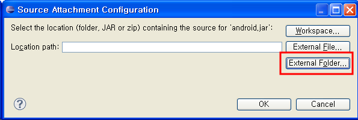

 !!!! 아래의 글은 2011년 4월 21일에 적은 것으로 현재는 android.git.kernel.org 에서 소스 코드 열람이 불가능합니다. 언제 구글에서 다시 가능하게 해줄지는 모릅니다;; 시간이 되면 다른 방법으로 소스를 받는 방법을 업데이트하도록 하겠습니다 !!!!

<http://android.git.kernel.org/> 에 안드로이드의 소스가 있는 것은 개발을 시작하신 많은 분들이 아는 내용이다. 하지만 여기서 자바 소스(framework)만 통째로 다운로드는 받는 것을 의외로 모르는 분들이 많아서 적어본다.
 위의 사이트에 접속하면, 당장 아래에 좌~~악 git 목록들이 나열되는데, 우리가 안드로이드 App 을 공부하면서 필요한 소스(framework 부분)는 platform/frameworks/base.git 에 있다고 생각하면 된다. 그래서 아래와 같이 라인의 제일 오른쪽의 tree 를 클릭하자.

아래와 같이 최신 소스를 볼 수 있고, 해당 화면에서 snapshot 을 누르면 해당 모듈 관련 최신 소스를 얻을 수 있다.

 참고로 위의 방법은 '최신 소스' 를 받는 것이다. 정확한 해당 버젼을 다운받으려면, 처음 android.git.kernel.org 에서 tree 를 클릭하지 않고, platform/frameworks/base.git 를 클릭하자.

 그리고, tag 부분에서 원하는 버젼을 선택하자. tags 는 쉽게 생각하면 해당 버젼을 릴리즈할 때의 소스를 말하는 것이다. 즉, 진저 브레드 릴리즈 될 때의 소스를 얻고 싶으면, 2.3.3 tags 소스를 받으면 된다.

이제 이 버젼의 소스에 접근하기 위해 tree 를 선택하자.

다시 펼쳐지는 소스 화면에서 snapshot 을 선택해서 파일을 다운받자.

이제 소스를 다운 받았으니 안드로이드 소스를 연결해보자. 먼저 다운받은 소스의 압축을 풀자.(압축풀때는 7zip 을 권장한다) 압축을 풀고 난 후 아래와 같은 위치에 해당 소스를 넣어두자.
 즉, 다운받은 프레임워크가 설치된 디렉토리(그림에서는 /home/zelon/Programs/android-sdk-linux\_x86/platforms/android-10) 아래에 sources 라는 디렉토리를 만들고, 그 아래에 frameworks, 그 아래에 api 디렉토리가 오는 구조로 위치시킨다.

 Android source 를 보기 위해, Activity 등의 안드로이드가 제공해주는 클래스 이름에 대고 오른 클릭한 후 Open Declaration 을 선택한다.

 만약 위와 같은 디렉토리 구조로도 아래처럼 창이 뜨면, 소스를 찾을 수 없기 때문인데 아래 그림의 Attach Source 버튼을 클릭하자.

  이제 아래와 같은 대화상자에서 External Folder 를 선택하고, 아까 압축을 푼 폴더를 선택해주면 된다.

 이제 마음껏 안드로이드 프레임워크 소스를 Open Declaration 기능을 통해 확인하도록 하자. :)

첨부파일: <a href="src_dir.png">src_dir.png</a> 