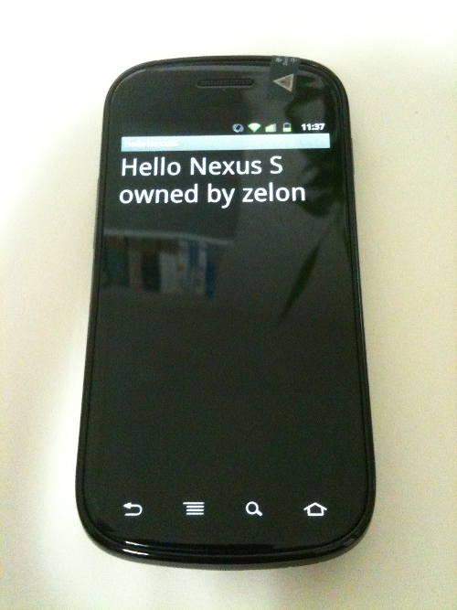

 근 2주간을 이것저것 재어보다가, 갤럭시S2 를 구입을 하지 않고, 넥서스S 로 결정... 55요금제에 기계값 12만원의 가격으로 구입했다. 정말 이래저래 고민하드라 나름 힘들었던 듯 ㅋ
 최대 장점은 구글의 레퍼런스 폰이어서, 여기저기(?)의 표준 역할을 해줄 수 있고, 안드로이드OS 의 지속적인 업그레이드가 보장된다. 그리고 다들 갤럭시S를 기다리고 있어서, 꽤 유니크하다는 정도? -\_-; 뭐 난 개발하기가 더 편하고, 레퍼런스 폰이라는데에 큰 의의를 뒀으니....... 라고 위안 중;;
 (2달 안에 나올 갤럭시S 관련 정보들에 비한) 단점은.... DMB, radio, 무인코딩, 듀얼코어, 외장 메모리, 좀더 나아진 화면, 화상통화, 꽤 괜찮다는 삼성UI, 그리고.... 회사 지원금... 정도 되겠다.
 난 꽤 많은 것을 포기하고 왔으나 꼭 만족스럽게 쓸테닷!!!
 일단 집에 와서 인증 전용을 위해 가볍게 헬로월드를 띄워서 스샷 한장~

 참고로 구글 레퍼런스 폰답게 드라이버 파일을 Android SDK Manager 에서 다운받을 수 있었다. 이런게 정말 개발자에게 큰 장점인듯~ 그리고 당연히 진저브레드가 올라가있으므로, 2.3.3 용으로 만든 어플을 바로 다운 가능. 이런데에서 그나마 위안을 얻는 중...ㅋ
 생각보다 삼성UI 가 꽤 광범위했었다는 것(주위가 보통 갤럭시S를 쓰니, 당연히 그렇게 동작할 줄 알았는데, 넥서스S는 훨씬 더 심플함)에 꽤나 놀랐고, 삼성UI 가 편리한게 좀 있었다는게 느껴짐(단축번호, notification area 에서의 wi-fi on/off등등). 그래도 익숙해지면 비슷비슷해질듯~
 이제.... 과연.... 여기에 뭘 만들어본다지????
 

첨부파일: <a href="사진.jpg">사진.jpg</a> 