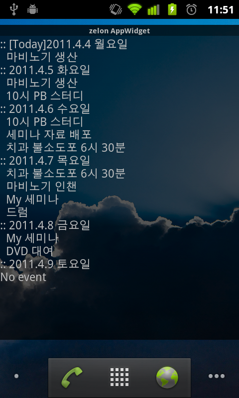

 드디어, hello world 를 제외하고 왠만큼 동작하는 안드로이드 프로그램을 완성했다. 역시 직접 폰을 가지고 만지면서 만들어봐야 하는 것 같다 ㅋ
 만들어진 코드를 보면 꽤나 짧지만 과정이 아직은 낯설고, xml 컴파일 에러와 런타임 에러가 좀 힘든듯 -\_-; 그래도 소스가 공개되어 있어서, 그 코드를 찾아보는게 꽤 재미있었고, 아무래도 내가 쓸 프로그램이니까 왠지 모를 뿌듯함이 좋다~~~
 아직 소소한(......) 버그가 있긴 하지만, 조금만 더 손 보면 될 거 같다....라고 믿는 중 ㅋ
 이거 만들면서 경험해본 것들은,
- Content Resolver
- Content Observer
- 외부의 activity 시작시키기
- AppWidget 만들기
- Android Test Project
- android open source 찾기 및 참조하기
 이정도 되겠다. 잔버그를 잡으면 소스 정리해서 github 에 한번 올려봐야겠다 :)
ps : 안드로이드 app 개발환경이 무척이나 괜찮다는 느낌이 든다. 오랜만에 최신 IDE(!!)를 써본듯;;
ps : Calendar 는 Contact 와 다르게 공식적인 content provider uri 가 없다 -\_-; 그래서 버젼마다 다를 수 있고, 현재 공개된 것은 리버스-엔지니어한 것들... 그래서 기계나 회사마나 다를 수 있단다... 쩝...
 
