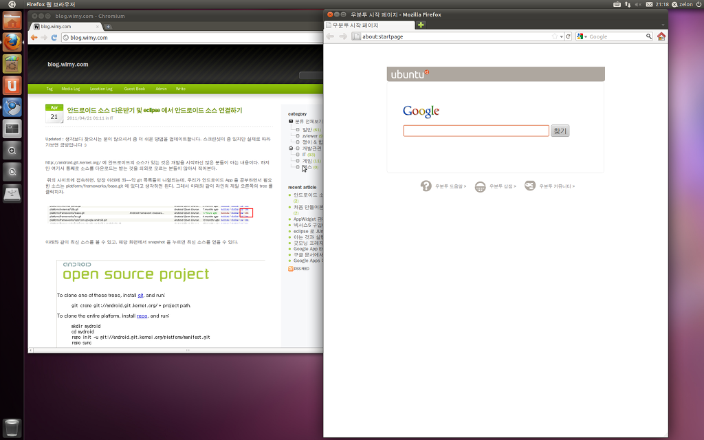

설치 과정에서 선택하는 것이 몇 단계 안된다.

몇몇 필수 질문이 시작되면서 동시에 파일 복사가 시작된다 멋지다. 즉, 설치 조건을 결정하는 몇몇 질문이 끝나면, 기타 설정등을 입력하는 동안 이미 파일들이 복사되기 시작하므로, 전체 설치 시간은 줄어든다.

설치도중 옵션을 켜면 인터넷으로 최신 버젼을 다운 받아버린다. 그래서 생각보다는 설치에 시간이 더 걸린다. 하지만 결과적으로 설치 후에도 다시 패치할 것을 생각하면 괜찮은 방법인 것 같다.

한글 언어관련을 인터넷에서 다운받으면서 4시간은 걸렸다. 인터넷회선도 느리지만, 한창 우분투 서버가 힘들 때라서 더 느린듯하다. 업데이트뿐만 아니라 다른 기본 패키지들도 받는것 같다.

윈도우 있는 파티션에 동시 사용으로 설치하는데 어떻게 설치될지 미리 보여주지 않아서 조금 불안한 시간이 있었다.

구입한지 3년쯤 된 컴퓨터라 그런지 대부분의 장치를 다 잡는듯(Wacom bamboo tablet 도 ok)

 
--- 설치 후 ---

윈도우 + a 로 프로그램을 쉽게 검색이 가능하다. 심지어 다운받을 수 있는 목록에서도 한꺼번에 검색이 가능해서, 설치되어 있지 않은 프로그램의 경우 클릭 2번에 설치가 가능하다.

창을 왼쪽, 오른쪽 모서리에 옮겨서 화면의 절반을 쓰게 하는 건 역시나 편리하다.

처음에는 unity 를 지원하지 않는 하드웨어라고 떴었으나, 제한된(독점) 드라이버를 설치하고 리부팅하니 자동으로 unity 가 떴다.

탐색기(내 컴퓨터, 내 위치 - 여튼 파일 탐색기에서) 고쳐야할 설정 파일에서 오른쪽 클릭하여, 다른 프로그램으로 열기 -&gt; 다른 프로그램 -&gt; 사용자 설정 명령어 사용에서, gksudo gvim 을 한번 실행해주면, 꽤 편하게, 탐색기에서 설정 파일들을 고칠 수 있다.

왼쪽에 보이는 아이콘들이 새로운 GUI Shell 인 Unity 의 대표적인 모습인데, 윈도우7을 쓰신 분들이라면 꽤 익숙한 인터페이스라고 생각이 들 수 있습니다.
 특히 윈도우키를 누르면, 마치 아이폰의 -1 페이지나, 안드로이드의 검색 화면처럼, 각종 프로그램들을 알아서 검색해주고, 윈도우키 + A 를 누르면, 다운받아서 설치할 수 있는 프로그램 목록들에서도 검색을 해줍니다. 꽤 편리합니다.
 그리고 윈도우키 + S 를 눌러서 전체 워크스페이스를 한 눈에 보여주는 Expo 기능이나, 윈도우키 + W 를 눌러서 현재 겹쳐져있는 창들을 한 눈에 보여주는 기능은 꽤 편리하게 사용할 수 있습니다.
 다만, 지금도 논란이 되고 있는 것처럼, 기존의 gnome 환경에 비해서는 세세한 설정이 힘들고, 아무래도 익숙하지 않기 때문에 이런저런 말들이 많습니다. 저는 아직까지는 쓸만한 것 같습니다. 

