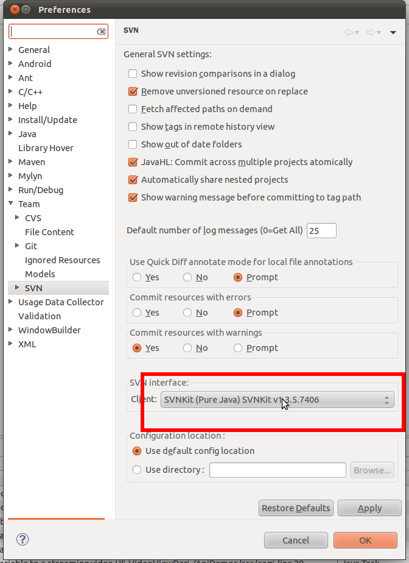

 우분투 리눅스에서 eclise & subclipse 로 svn(subversion) 사용시 commit 시에 chmod 를 할 수 없다면서 에러를 낼 경우에는 다음과 같이 SVN interface Client 를 바꾸면 해결이 된다. 만약 Client 에 SVNKit 이 없다면, subclipse 설치시에 SVNKit 모듈을 설치했는지 확인하자.

 
 If you face a error related chmod when using subclipse on ntfs repository, try to change SVN interface Client to SVNKit. If there is no SVNKit, please check installed module of subclipse. :)
 
