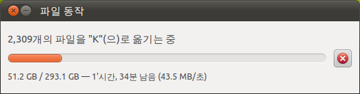

 하드디스크를 정리하다가, 문득 못보던 아이콘이 있어서 확인해보니, 정말 소소하지만 사용자 편의를 도와주는 기능을 발견했다.

 바로 위의 화살표인데, 아래와 같이 파일 동작(복사, 이동 등) 중이면 위의 아이콘이 생긴다. 그리고 이 아이콘을 클릭하면 복사 대화창 보이기라는 명령을 내릴 수 있는데, 이 명령을 내리면, 아래의 창이 다른 창에 가려 안 보이더라도 앞으로 보여준다.

 시간이 오래 걸리는 복사/이동 등의 명령을 내려놓으면, 언제 끝나나, 다 끝났나 하는 마음으로 한번씩 창을 뒤져서 저 창을 보거나, 늘 보이는 위치에 저 창을 위치 시켜놓는데, 이런 아이콘을 하나 보여주고, 창을 앞으로 옮겨주도록 해놓아서 꽤 편리하게 사용할 수 있었다.
 리눅스로 데스크탑 환경을 옮기면서 꽤 마음에 드는 기능~~
 

