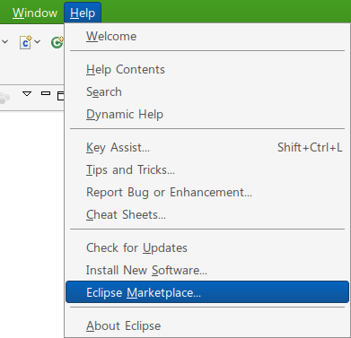

eclipse marketplace 기능이 들어온지도 어느 정도 지났는데([Helios 부터 추가되었음](http://blog.wimy.com/324 "[http://blog.wimy.com/324]로 이동합니다.")), 각종 글들이 아직도 url 을 넣는 방식으로 설명하고 있다. 좀 아쉬운 상황.
이제는 유명한 플러그인이라면, marketplace 에서 검색해보자~

 위와 같이 Help -&gt; Eclipse Marketplace 를 클릭하자.

 간단히 Find 창에 원하는 플러그인을 검색하면 바로 install 이 가능하다.
 PyDev(python 개발환경), Subclipse(subversion 사용), FindBugs(Java 버그 찾기) 등은 이와 같은 방법을 통해 쉽게 설치할 수 있다.
 유명한 플러그인이라면서 번거롭게 홈페이지에서 설치 url 을 찾기 위해 시간을 낭비하지 말자~!!
