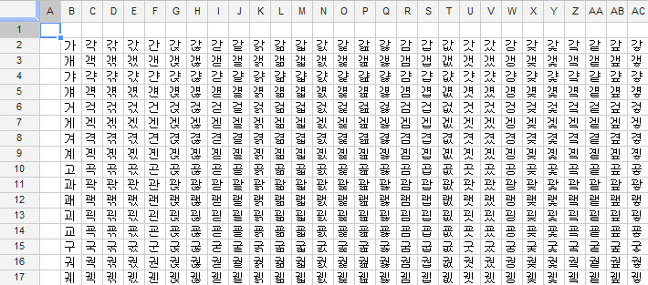

 얼마전, 11월 10일 너무나 예쁘고 사랑스러운 공주님이 태어났다. 자다가 한번씩 깨서 몸은 힘들지만, 지친 몸을 이끌고도 안겨있는 아기를 보면 정말 사랑스럽다는 생각이 든다. 개인적으로 신생아 중에 매우 예쁘게 나왔다고 생각한다 ㅋㅋ 2.6kg 에 51cm 로 늘씬~ 신기하게도 퉁퉁 불거나, 붓기도 없이 태어났음~

  어머니께서 절에서 좋은 이름을 지어주셨지만, 왠지 마음에 들지 않아 이름을 직접 지어보기로 했다. 작명책을 하나 사서 이런저런 음양오행도 훑어보고 했지만, 뭔가 글자를 주욱 펼쳐놓고 맘에 안드는 글자를 지워가면서 마음에 드는 글자를 찾아보면 어떨까 했다... 일명 소거법 ㅋㅋ 그래서 '가갸거겨....' 이런 생각을 하다가 프로그래머의 마인드로 유니코드가 생각났다 -\_-; 전에 잠깐 공부할 때, '가' 부터 '힣' 까지가 유니코드의 특정 범위 안에 다 있으므로, '가' 부터 '힣' 까지 반복문을 돌면서 엑셀에 주욱 적고 맘에 안드는 글자 지워나가기...
 다만, 그냥 엑셀로 하면 재미가 없으니까 전에 잠깐 보다가 접어둔, 구글 문서 스크립트로 해보자. 그리고 일단 다 만들어놓고, 아내와 문서를 공유해서, 나도 지우고 아내도 지우고해서 남은 글자들 중에서 골라보자... ㅋㅋ
 생각보다 구글 문서의 스크립트는 쉬웠다. 기본적인 사용은 자바스크립트와 같고, 구글에서 제공해주는 API 는 메뉴 중 도움말에 깔끔하게 정리되어 있고, 매우 간단한 예제코드도 포함되어 있었다.
 다음은 내가 만들어본 '가' 부터 '힣' 까지를 구글 스프레드시트에 채워주는 스크립트이다.

<table>
<colgroup>
<col width="100%" />
</colgroup>
<tbody>
<tr class="odd">
<td>

function makeNames()

{

  var startIndex = '가'.charCodeAt(0);

  var endIndex = '힣'.charCodeAt(0);

  

  var sheet = SpreadsheetApp.getActiveSheet();

  var rowCount = 2;

  var colCount = 2;

  

  for ( var unicodeIndex=startIndex; unicodeIndex&lt;=endIndex; unicodeIndex=unicodeIndex+1 )

  {

    var range = sheet.getRange(rowCount, colCount);

    

    range.setValue(String.fromCharCode(unicodeIndex));

 

    colCount = colCount + 1;

    

    if ( colCount == 30 )

    {

      colCount =2;

      rowCount++;

    }

  }

} 

</td>
</tr>
</tbody>
</table>

이렇게 만들어진 한글표(컬럼 크기 조절은 수동).....;;; 

 자, 이제 이 중에서 가장 예쁘고, 건강한 글자를 골라서 이름을 만들어보자 -0-/
 먼저 쌍자음인거 주욱 지우고, 받침도 쌍자음인거 지우고, 겹모음인거 중에서 이름으로 거의 안 쓰는거 주욱 지우면, 꽤 많이 지워짐. 이 중에서 남자 이름 혹은 뜻이 안 좋은거, 발음 어려운거 등등을 하나씩 지우고, 왠지 마음에 안 드는 거 지우니, 60여개가 남음.
 이제 남은 것을 앞뒤로 프로그래밍으로 크로스해서 쭈욱 다시 뽑아낸 후, 60\*60 = 3600 여개 중에서 마음에 드는 이름들을 뽑아내고, 그 중에서 주위에 물어보고, 투표하고 등등으로 검증 후 이름 결정할 것임~ :)
 ps : 구글 문서를 써서 아내랑 같이 공동 작업하니 꽤 괜찮음. 부모님이나, 친구들까지 가세해준다면?... ^^;
 ps : 60개였는데, 작명책보면서 괜찮아보이는 음절 추가하였더니, x\*x=약12,000개 나옴.... 뭐 그래도 그 중에서 괜찮은 300여개 고르는데 3시간 정도 걸림. 이정도야 내 아이 좋은 이름 짓는데 걸리는 시간치곤 양호함. 이제 다시 여기서 10여개만 남도록 진행!!!
 
