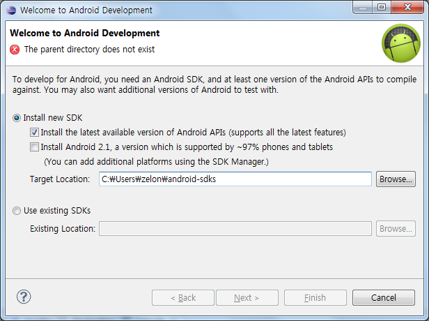

 어느샌가(ADT r14 버젼 이 후) 이제 eclipse 의 플러그인인 ADT(Android Development Tool)만 설치하면 아래 화면과 같이 최신 SDK 를 쉽게 설치할 수 있게 되었다.

 기존에는 SDK 를 직접 받아서 설치하고, ADT 를 설치해야했지만, 이제 ADT 만 설치하면 ADT 를 통해서 쉽게 SDK 도 설치가 가능해졌다. ( <http://tools.android.com/recent/welcomewizard> ) 참고. 
 이제 초보 안드로이드 개발자들은 Java -&gt; eclipse -&gt; ADT 만 기억하면 된다~  
