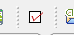
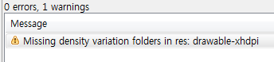
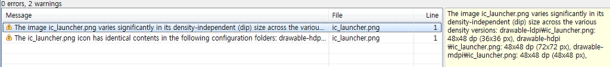
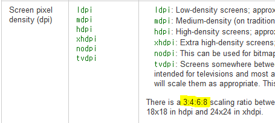

 안드로이드 개발툴의 최신 버젼(ADT 16버젼 - 2011년 12월)에는 Lint 라는 툴이 추가되었다. 설치 후, 화면에 아래와 같은 아이콘을 클릭하면, Lint 를 실행하여 잠재적으로 문제가 있는 부분을 알려주게 된다.

 그런데,  웃긴건 안드로이드 기본 프로젝트를 생성해도 위와 같은 경고를 보여준다는 것이다. 위 내용을 읽어보면, drawable-xhdpi 라는 density 가 없다는 것인데, 요즘 고해상도 폰이 많이 나오면서 높은 해상도를 지원하라는 의미로 받아들이고, 일단 res 디렉토리 아래에 drawable-xhdpi 를 만들고, 임시로, drawable-hdpi 의 이미지 파일을 넣어보자. 그러면....

 위와 같이 해상도 크기가 다르니 어쩌고 저쩌고 한다.... 에잇 그래서 대충 뒤져보니, <http://developer.android.com/guide/topics/resources/providing-resources.html> 의 중간쯤을 보면, ldpi, mdpi, hdpi, xhdpi 이런 부분을 보면 3:4:6:8 의 크기로 하라는 얘기가 있다. 즉, ldpi:mdpi:hdpi:xhdpi = 3:4:6:8 로 하라는 이야기이다.

 기존의 우리가 새로 만든게 xhdpi 이므로, mdpi 에 있는 아이콘 크기의 2배로 하면 되겠다. 그래서 mdpi 의 크기를 보면 기본적으로 48x48 이므로, 우리는 96x96 크기의 아이콘을 만들어서 넣어주면 되겠다.
 이제 Lint 를 다시 실행시켜보면 깔끔하게 하나의 경고도 없는 것을 볼 수 있다.
 아마 ADT 최신 버젼이 나오면 알아서 xhdpi 용 아이콘을 넣어주지 않을까 싶지만, 임시로 이렇게 해서 깔끔하게 Lint 사용을 시작해보자~
 
