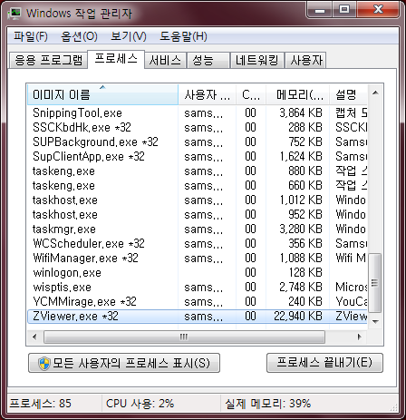

 작업 관리자를 띄웠을 때 자신의 프로세스 옆에 \*32 표시가 있으면 32비트 모드로 실행되는 것이다. ( <http://en.wikipedia.org/wiki/Windows_XP_editions#Windows_XP_64-Bit_Edition> ) 참고.
ps : ZViewer 가 32비트로 실행되는구나... 64비트도 한번 빌드해봐야 할 듯 :) 
