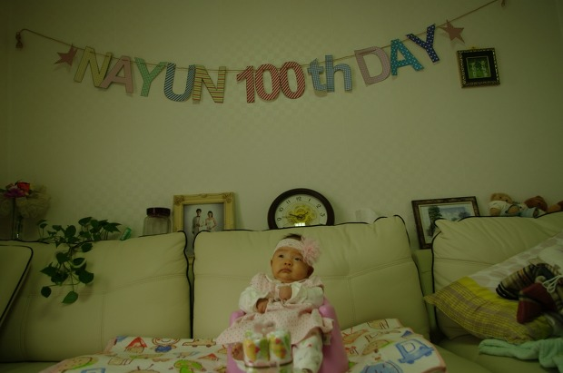
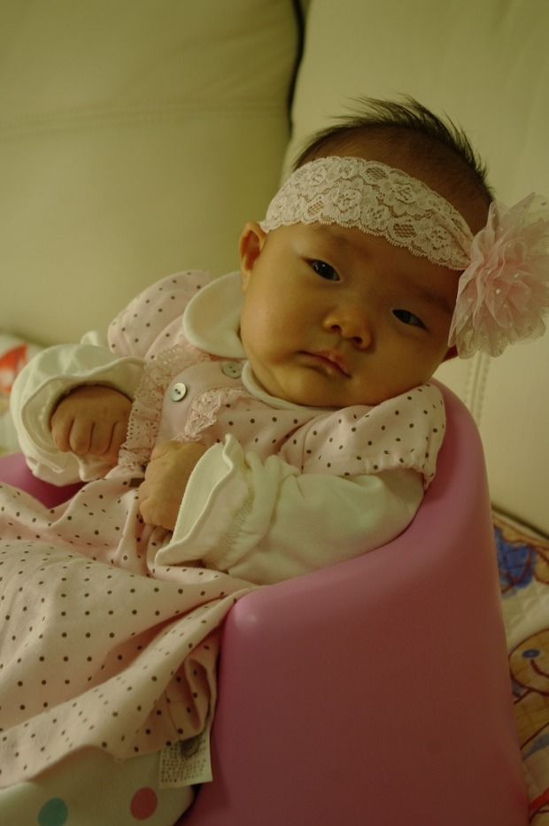

나윤이 100일을 준비하면서 만들어본 글자들... <http://heena_mom.blog.me/30126587893> 을 보고 한번 만들어봤다. inkscape 에서 SVG 형식으로 편집~
 한글자씩 A4 에 프린트해서 약간 두꺼운 종이에 붙인 후, 오려서 노끈으로 연결한 후 벽에 걸면 끝~
 SVG 파일 올려둡니다.

 

첨부파일: <a href="Nayun100day.svg">Nayun100day.svg</a> 