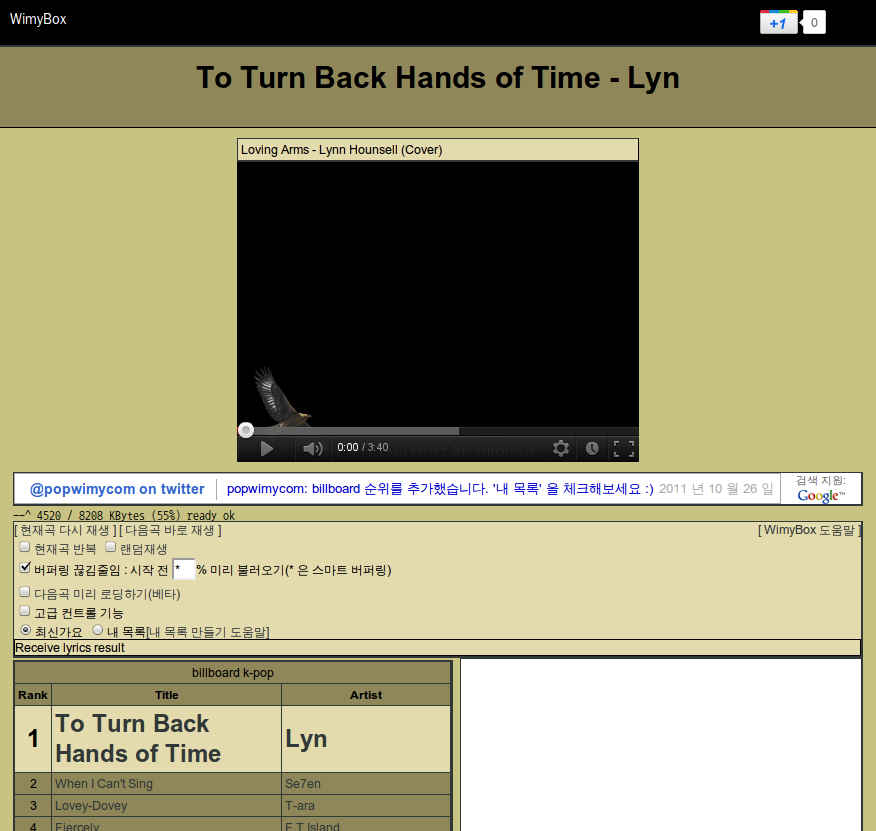
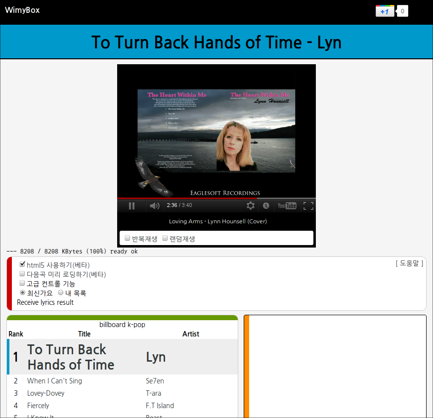

 오랜만에 주말동안 열코딩을 했습니다. 사실 코딩쪽은 코드 정리와 html5 YouTubeAPI 정도이고, CSS 를 통한 디자인 작업을 거의 했습니다.
 기능 추가는 다음과 같습니다.
 - mobile device 에서 접속 혹은 창 크기가 작을 때 mobile 용 레이아웃으로 보여줌
 - html5 YouTubeAPI 를 통해 html5 기반의 플레이어를 지원합니다. flash 를 지원하지 않는 iPhone 에서도 반수동으로 플레이가 (겨우) 가능. 안드로이드 폰에서도 html5 mode 로 재생 지원 가능
 - 불필요한 라이브러리를 제거하여 시작 속도를 향상
 - color tag design 에서 사용한 이미지 파일을 CSS 에 내장하여 속도 저하가 거의 없음
 디자인은 아래와 같이 변경되었습니다. 아래의 before / after 만 봐도 훨씬 산뜻하게 변경되었습니다~ color tag design 이라고 하면 될듯~ (색상은 안드로이드 ICS 에서 권장색상들을 사용 ^^)

 앞으로 box.wimy.com 로 이용해주세요~ pop.wimy.com 라고 웹주소만 쓰다가 이제 WimyBox 라는 이름도 생겼답니다. 조만간 pop.wimy.com 접속시 box.wimy.com 로 자동으로 옮겨가도록 할 예정입니다. 

