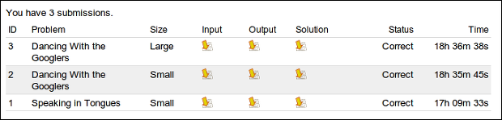

구글 코드잼(<http://code.google.com/codejam>) 은 일종의 알고리즘 대회이다. 주어진 문제를 원하는 프로그래밍 언어로 풀고, 입력값을 받아서 출력값을 소스코드와 함께 제한된 시간 안에 제출하면 된다.

 각 문제당 small/large 2종류의 입력값이 있고, 이에 따른 점수가 다르며, small 문제를 제대로 풀어야 large 문제를 풀 수 있다. small 문제는 한번 틀리면 다시 제출이 가능하지만, large 문제는 한번만 제출이 가능하며 대회 끝난 후 정답 체크를 해준다.

 일단 해당 사이트에 들어가면 연습 문제를 풀어볼 수 있는데, 연습문제를 풀다보면 어떤 형태로 문제가 제출되는지를 알 수 있다. 그리고 모든 문제가 예제 입력/예제 결과가 있는데, 이를 이용하면 TDD(Test Driven Development) 형태로 자신의 프로그램을 테스트해가면서 프로그래밍할 수 있다.

 지난 구글 코리아 한국대회를 일주일 정도(퇴근 후 집에서) 준비하면서, 몇 문제를 풀어보면서 실제 대회에서 쓰일 기본 코드와 unittest 환경을 만들었다. 아무래도 주 사용언어는 C++ 이고, 10년 정도 써온 Visual Studio 를 쓰면 좋았겠지만, 무료 개발툴만 사용이 권장되었고, 마침 집에서는 linux desktop(ubuntu)을 쓰고 있어서 linux + gcc + python + vim 을 사용하기로 했다. 사실 많이 익숙하지는 않지만, 그래도 제법 손에 익어있는 상태라서 써보기로 했다. 참고로 구글 코리아 한국대회는 예선통과 실패. 이번 세계 대회는 예선 통과 ㅋ 딱히 공부는 안 했는데 경험 문제도 있겠지만, 구글 코리아 문제가 훨씬 어렵게 나온듯;;

 일단 unittest 환경은 간단히 직접 만들어보았는데, test.in 파일을 입력받아서, test.expect 의 내용과 같은 출력을 해주느냐를 비교하기로 했다. 코드잼 사이트의 문제는 항상 예제 입력/예제 결과가 있으므로, 예제 입력을 copy/paste 해서 test.in 파일에 넣고, 예제 결과를 test.expect 에 넣고 python 으로 내 프로그램을 동작시키고 입력을 test.in 에서 받아 넣고, 출력을 test.expect 파일과 비교하는 것이다. 그리고 unittest 가 failed 면, 간단히 gvim 으로 어떻게 잘못되었는지 diff 를 보여주도록 했다.

 코드는 아래와 같다.

> \#!/usr/bin/python
>
> import os
>
> import subprocess
>
> import filecmp
>
> testInputFilename = "test.in"
>
> testExpectFilename = "test.expect"
>
> testExeFilename = "./a.out"
>
> testCompareOutputFilename = "test.result"
>
> def checkFile(filename):
>
>  if os.path.exists(filename) == False:
>
>  print("No " + filename + " file")
>
>  return False;
>
>  return True
>
> def checkCondition():
>
>  allOK = True
>
>  if checkFile(testInputFilename) == False:
>
>  allOK = False
>
>  if checkFile(testExpectFilename) == False:
>
>  allOK = False
>
>  if checkFile(testExeFilename) == False:
>
>  allOK = False
>
>  return allOK
>
> def checkResult():
>
>  print("Checking result...")
>
>  if checkFile(testCompareOutputFilename) == False:
>
>  return False
>
>  if checkFile(testExpectFilename) == False:
>
>  return False
>
>  print("\#\#\#\#\#\#\#\#\#\#\#\#\#\#\#\#\#\#\#\#\#\#\#\#\#\#\#\#\#\#\#\#\#\#\#\#\#\#\#\#\#\#\#\#\#\#\#\#\#\#\#")
>
>  if filecmp.cmp(testCompareOutputFilename, testExpectFilename) == False:
>
>  print("\[FAILED\] Test failed")
>
>  print("\#\#\#\#\#\#\#\#\#\#\#\#\#\#\#\#\#\#\#\#\#\#\#\#\#\#\#\#\#\#\#\#\#\#\#\#\#\#\#\#\#\#\#\#\#\#\#\#\#\#\#")
>
>  \#os.system("diff -urN " + testExpectFilename + " " + testCompareOutputFilename)
>
>  os.system("gvim -d " + testCompareOutputFilename + " " + testExpectFilename + " &")
>
>  else:
>
>  print("\[OK\] Test pass")
>
>  print("\#\#\#\#\#\#\#\#\#\#\#\#\#\#\#\#\#\#\#\#\#\#\#\#\#\#\#\#\#\#\#\#\#\#\#\#\#\#\#\#\#\#\#\#\#\#\#\#\#\#\#")
>
>  print("\#\#\#\#\#\#\#\#\#\#\#\#\#\#\#\#\#\#\#\#\#\#\#\#\#\#\#\#\#\#\#\#\#\#\#\#\#\#\#\#\#\#\#\#\#\#\#\#\#\#\#")
>
> def compile():
>
>  os.system("rm ./a.out")
>
>  os.system("g++ -g a.cpp")
>
>  return os.path.exists("./a.out")
>
> def testmain():
>
>  if compile() == False:
>
>  return
>
>  if checkCondition() == False:
>
>  return
>
>  fin = open(testInputFilename, "r")
>
>  results = subprocess.check\_output(testExeFilename, stdin=fin)
>
>  print(results)
>
>  fresult = open(testCompareOutputFilename, "w")
>
>  fresult.write(results)
>
>  fresult.close()
>
>  fin.close()
>
>  if results.find("DebugPrint") == -1:
>
>  checkResult()
>
>  else:
>
>  print("\[DebugPrint mode is on\]")
>
> if \_\_name\_\_ == "\_\_main\_\_":
>
>  testmain()
>
 위의 unittest 를 쓸 때는 항상 소스 파일 명을 a.cpp 로 저장하고, codejam.py 를 실행시킨다. 그러면 위의 코드가 컴파일과 실행, test.in 에서의 입력, test.expect 와의 비교를 하는 것이다.

 이 예제 입력/결과를 통한 unittest 를 통과하면, 실제로 코드잼 사이트에서 실제 입력을 받아서 실행시키고, 제출하였다. 대부분 small 문제는 거의 바로 통과가 되었다.

 일단 위와 같은 방법으로 코드잼을 위한 기본 unittest 설정을 하였고, 최근에 코드잼에 있었던 <a href="http://code.google.com/codejam/contest/dashboard?c=1460488#s=p1" class="tx-link">&quot;Dancing With the Googlers&quot;</a> 문제를 한번 풀어보자.

 문제는 대략 아래와 같다(내가 번역한 게 맞다면 ㅋ) - 약간의 의역 포함

 춤을 추는 구글직원을 보고 3명이 평가를 한다. 한 명의 심사위원이 0부터 10점까지의 점수를 매길 수 있다. 하지만 심사 위원이 거의 비슷한 기준을 가지고 있어서 거의 비슷한 점수를 주는데, 3명이 평가한 점수 중 2점 넘게 차이는 나지 않는다. 2점 점수 차이가 나면 surprising 라고 부른다. 예를 들면, (8,8,8), (7,8,7) 이렇게 점수가 날 수 있고, (6,7,8), (6,8,8) 은 surprising 이다. (7,6,9) 와 같은 점수는 절대 나오지 않는다(6점과 9점은 3점 차이가 나므로). 특정 점수 p 와 surprising 의 갯수 s가 주어졌을 때 한 명이 받은 점수 중 가장 큰 값이 p 이상인 갯수가 가장 큰 값(Answer)을 찾는 것이다.

 (사실 설명이 좀 복잡하다 -\_- 이게 사실 영어라서 더 헛갈리는데;;;;)

 

 예제 입력을 보면,

3 1 5 15 13 11

이렇게 한줄당 하나의 결과값 3 을 얻게 되는데, 숫자 하나씩 분석해보자.

제일 앞의 숫자 3은 춤을 춘 구글직원이 3명이라는 뜻이다.

두번째 숫자 1은 surprising 의 갯수이다. 즉, 3명이 춤을 줬고, 한명당 3개의 점수를 받는데(심사위원이 3명이니), 이 3명 중 누군가 1명이 받은 점수는 제일 작은 점수와 제일 큰 점수가 2점 차이가 난다는 뜻이다.

세번째 숫자 5는 앞에서 설명한 특정 점수 p 이다. p 점 이상을 받은 적이 있는 사람의 숫자를 카운트해야한다.

나머지 3개의 숫자(15 13 11) 은 각 한명당 받은 총점이다. 제일 앞의 숫자가 3이었기 때문에, 여기 숫자가 3개(15 13 11)가 오는 것이다. 이 총점을 가지고, 각 사람이 받은 점수를 찾아내야 한다.

 15 13 11 이 숫자 3개는 각 사람이 받은 총점인데,

 15점 받았다면, (5,5,5) 혹은 (4,5,6) 을 받았을 수도 있다.

 마찬가지로 13점을 받은 사람은 (4,4,5) 점을 받거나, (3,5,5) 점을 받았을 것이다.

 마찬가지로 11 점은 (3,4,4) 혹은 (3,3,5) 점을 받았다.

 즉, 다음과 같은 점수를 받았다. 잘 살펴보면, 왼쪽이 일반(!) 점수, 오른쪽이 surprising 이 발생했을 때의 점수이다.

1번 구글직원 : (5,5,5) 혹은 (4,5,6)

2번 구글직원 : (4,4,5) 혹은 (3,5,5)

3번 구글직원 : (3,4,4) 혹은 (3,3,5)

 일단 각 사람이 받은 점수가 나왔으니, 이제 특정 점수 p 를 살펴보자. p 가 5점이다. 3명의 구글직원 중에 surprising 없이도 자신의 점수 중 최고점이 5점 이상이 되는 사람은 2명(1번,2번)이다. 여기서 surprising 의 갯수가 1이므로, 만약 surprising 이 3번 구글직원에게 발생했다면, 3번의 점수는 (3,3,5) 이 되므로, 최고점이 5점 이상이 되는 직원은  3명(1번,2번,3번 모두)이 되게 된다. 만약 surprising 이 1번 혹은 2번에게 발생했다면 2명이 된다. 그러므로 우리는 3번이 surprising 이 발생했다고 생각하는게 좋다. 그래야만 좀 더 큰 결과값을 얻기 때문이다. 그래서 이 문제의 답은 3. 3명이 된다.

 이 문제의 핵심은 2가지로 볼 수 있다. 하나는 총점 x 가 주어졌을 때 받은 점수 (a,b,c) 를 결정하는 것이고, 다른 하나는 surprising 이 있을 경우 누가 surprising 을 받느냐를 잘 결정하는 것이다. surprising 을 잘 줘야 큰 결과값을 얻을 수 있게 된다.

 이제 본격적으로 문제를 풀어보자.

 총점 x 가 있을 때 점수 (a,b,c) 를 어떻게 계산할까. 사실 이런 부분이 알고리즘 문제를 풀 때 많이 막막하긴 한데, 직접 이리저리 예제를 가지고 몇번 풀어보면 어떤 법칙을 발견할 수 있기도 하고, 일종의 직관으로 해답을 찾을 수 있기도 하다. 뭐, 제대로 풀려면 수학적인 '증명' 이 필요할 거 같기도 하지만, 일단 중요한건 풀어내는 것이니;; 일단 총점 x = a + b + c 이고, 채점 기준이 비슷하다고 해서 간단히 나누기 3을 해봤다....;;; 채점은 항상 정수이니 소수점은 간단히 버렸다. 그러니 재미있는 현상을 발견할 수 있는데,

15 는 (5,5,5) 가 나온다. ok

13 은 (4,4,4) 가 나온다. 4+4+4 = 12 이므로 어딘가에는 +1 을 해줘야한다. 그냥 아무대나 해보자 (4,4,5). ok

11 은 (3,3,3) 이 나온다. 3+3+3 = 9 이므로, 2점이 모자란다. 이리저리 해볼 경우의 수가 많다. 어느 한 숫자에 +2 를 해줘도 되고. 2개의 숫자에 각각 +1 을 해줘도 된다. 일단 한 숫자에 +2를 해보면, (3,3,5) ok. 2개의 숫자에 +1 을 해보면, (3,4,4) ok. 

 일단 이렇게 생각된다. 이런식으로 예제를 다 풀어보니, 어떤 규칙이 발견되었다.

 my1 : 숫자 3개의 나열은 순서에 의미가 없다. 즉, (3,4,5) 나 (5,4,3) 은 결과적으로 같다. 왜냐하면, 답을 구하기 위해 필요한 것은 최대값이기 때문이다. 그러므로 이제 점수의 조합은 보기쉽게, 항상 오름차순으로 정렬해서 생각하자. 이제 총점이 x 일 때 (x/3, x/3, x/3) 을 만든 후, 1점이 부족하면 제일 뒤의 숫자에 1을 더해주고, 2점이 부족하면, 두번째와 세번째에 각각 1을 더해주면, (a,b,c) 조합을 찾을 수 있다.

 my2 : 총점이 15점이면, (5,5,5) 가 될 수 있고, (4,5,6) 이 될 수 있고, (3,5,7) 도 될 수 있지만, 앞의 규칙(2점 넘게 차이가 나면 안됨)에 의해서, 3점 7점이 동시에 나올 수는 없다. 그래서 (5,5,5), (4,5,6) 밖에 될 수 없다. 숫자의 조합을 여러게 만들 수 있지만, 총점이 15점으로 고정되어 있다는 것은, 어떤 숫자가 변화되면, 그 변화된만큼 다른 숫자가 가져가게 된다. 그러므로, 만약 (5,5,5) 에서 앞의 숫자가 4가 되면, 뒤의 숫자 중 하나는 반드시 6이 되어야한다. 그리고 my1 에 의해서 순서는 의미가 없으므로, (5,5,5) 를 기준으로 1만큼 변화가 되는 조합은 (4,5,6) 밖에 없다. 즉, 앞의 숫자에서 1을 빼고, 뺀 1을 뒤의 숫자에 더해주는 것이다. 이제 2만큼 변화가 되는 조합을 생각해보자. (5,5,5) 에서 앞의 숫자에서 2를 빼고, 뒤에 숫자에 2를 더해보자. (3,5,7) 이 나온다. 3,7은 4만큼 차이가 나므로 안된다.

 my3 : 숫자 조합에서 변화가 있으려면, 같은 숫자가 2개 있어야 변화가 가능하다. 그래야 둘중 하나에서 1을 빼서 다른 하나에 1을 더해야 총점이 유지되며, 2개 숫자의 차이가 2를 초과하지 않는다. 즉, (3,4,5) 은 (2,5,5) 가 될 수 없다. 그리고 이 '변화' 를 하면, 항상 surprising 이 되는 셈이다. 즉, my1 에서 구한 숫자 조합 중에 같은 숫자가 2개 있으면 '변화' 를 시킬 수 있으며, '변화' 가 일어나면 항상 surprising 이 된다.

 아... 문제를 다 풀고나서 정리하는데도 복잡하구나;;;; 수학적으로 증명하면 좋겠지만 그럴 능력은 없어서 생략한다 -\_-;

 여튼 결론은,

 - 총점 x 가 있을 때 (x/3, x/3, x/3) 으로 3개의 숫자를 일단 만들고, 부족한 점수는 3번째, 2번째 순서로 +1 씩을 해서 총점 x 를 맞추자.

 - (a,b,c) 조합 중에서 같은 숫자 2개가 있으면 앞의 숫자에서 1을 빼고, 뒤의 숫자에 1을 더하는 '변화' 가 되어서, surprising 이 될 수 있다.

 - surprising 이 될 때 최대값이 +1 될 수 있다.

 - '답' 을 구할 때는, 특정점수 p 와 surprising 갯수 s 가 주어졌을 때 surprising 하지 않았을 때는 p 보다 작지만, surprising 했을 때 p 이상이 되는 경우를 s 갯수만큼 찾으면 된다.

 문제 해결 코드는 아래와 같다.

> \#include &lt;algorithm&gt;
>
> \#include &lt;vector&gt;
>
> \#include &lt;stack&gt;
>
> \#include &lt;iostream&gt;
>
> \#include &lt;sstream&gt;
>
> \#include &lt;fstream&gt;
>
> using namespace std;
>
> stringstream emptyOut;
>
> \#define DP\_ON 0
>
> \#if DP\_ON
>
> \#define DP std::cout &lt;&lt; "\[DebugPrint\]:"
>
> \#else
>
> \#define DP emptyOut
>
> \#endif
>
> const int CANNOT\_GO = -1;
>
> int getintline()
>
> {
>
>  string data;
>
>  getline(cin, data);
>
>  stringstream s;
>
>  s &lt;&lt; data;
>
>  int ret;
>
>  s &gt;&gt; ret;
>
>  return ret;
>
> }
>
> vector &lt; int &gt; getintvectorline()
>
> {
>
>  vector &lt; int &gt; ret;
>
>  string data;
>
>  getline(cin, data);
>
>  stringstream s, debugstream;
>
>  s &lt;&lt; data;
>
>  debugstream &lt;&lt; "getintvector : ";
>
>  while ( !s.eof() )
>
>  {
>
>  int v;
>
>  s &gt;&gt; v;
>
>  debugstream &lt;&lt; " " &lt;&lt; v;
>
>  ret.push\_back(v);
>
>  }
>
>  DP &lt;&lt; debugstream.str().c\_str() &lt;&lt; endl;
>
>  return ret;
>
> }
>
> string getstringline()
>
> {
>
>  string data;
>
>  getline(cin, data);
>
>  return data;
>
> }
>
> struct P2
>
> {
>
>  int max1;
>
>  int max2;
>
> };
>
> vector &lt; P2 &gt; g;
>
> P2 getV(int input)
>
> {
>
>  if ( g\[input\].max1 &gt;= 0 ) return g\[input\];
>
>  P2 result;
>
>  int v = input/3;
>
>  vector &lt; int &gt; r;
>
>  r.push\_back(v);
>
>  r.push\_back(v);
>
>  r.push\_back(v);
>
>  int current = r\[0\] + r\[1\] + r\[2\];
>
>  result.max1 = -1;
>
>  result.max2 = -1;
>
>  if ( current &lt; input )
>
>  {
>
>  r\[2\] = r\[2\] + 1;
>
>  }
>
>  current = r\[0\] + r\[1\] + r\[2\];
>
>  if ( current &lt; input )
>
>  {
>
>  r\[1\] = r\[1\] + 1;
>
>  }
>
>  result.max1 = result.max2 = r\[2\];
>
>  bool bChanged = false;
>
>  for ( int i=0; i&lt;3; ++i )
>
>  {
>
>  for ( int j=0; j&lt;3; ++j )
>
>  {
>
>  if ( i == j ) continue;
>
>  if ( r\[i\] == r\[j\] && r\[i\] != 0 )
>
>  {
>
>  DP &lt;&lt; "same found" &lt;&lt; endl;
>
>  r.push\_back(r\[0\]);
>
>  r.push\_back(r\[1\]);
>
>  r.push\_back(r\[2\]);
>
>  r\[3+i\] = r\[3+i\] - 1;
>
>  r\[3+j\] = r\[3+j\] + 1;
>
>  result.max2 = r\[3+j\];
>
>  
>
>  bChanged = true;
>
>  break;
>
>  }
>
>  }
>
>  if ( bChanged ) break;
>
>  }
>
>  for ( int i=0; i&lt;r.size(); ++i )
>
>  {
>
>  DP &lt;&lt; "r\[" &lt;&lt; i &lt;&lt; "\] : " &lt;&lt; r\[i\] &lt;&lt; endl;
>
>  }
>
>  g\[input\] = result;
>
>  return result;
>
> }
>
> void doOperation(int caseNo)
>
> {
>
>  vector &lt; int &gt; singleline = getintvectorline();
>
>  int N\_numberOfGooglers = singleline\[0\];
>
>  int S\_numberOfSurprising = singleline\[1\];
>
>  int p = singleline\[2\];
>
>  int answer = 0;
>
>  P2 \* points = new P2\[N\_numberOfGooglers\];
>
>  for ( size\_t i=0; i&lt;N\_numberOfGooglers; ++i )
>
>  {
>
>  points\[i\] = getV(singleline\[i+3\]);
>
>  DP &lt;&lt; "before points " &lt;&lt; points\[i\].max1 &lt;&lt; "," &lt;&lt; points\[i\].max2 &lt;&lt; endl;
>
>  if ( points\[i\].max1 &lt; p && points\[i\].max2 &gt;= p 
>
>  && S\_numberOfSurprising &gt; 0 )
>
>  {
>
>  --S\_numberOfSurprising;
>
>  points\[i\].max1 = points\[i\].max2;
>
>  }
>
>  DP &lt;&lt; "after points " &lt;&lt; points\[i\].max1 &lt;&lt; "," &lt;&lt; points\[i\].max2 &lt;&lt; endl;
>
>  }
>
>  for ( size\_t i=0; i&lt;N\_numberOfGooglers; ++i )
>
>  {
>
>  if ( points\[i\].max1 &gt;= p )
>
>  {
>
>  ++answer;
>
>  }
>
>  }
>
>  cout &lt;&lt; "Case \#" &lt;&lt; caseNo &lt;&lt; ": " &lt;&lt; answer &lt;&lt; endl;
>
>  delete \[\] points;
>
> }
>
> void init()
>
> {
>
>  DP &lt;&lt; "init..." &lt;&lt; endl;
>
>  g.resize(31);
>
>  for ( int i=0; i&lt;= 30; ++i )
>
>  {
>
>  g\[i\].max1 = -1;
>
>  g\[i\].max2 = -1;
>
>  }
>
> }
>
> int main(int argc, char \* \[\])
>
> {
>
>  DP &lt;&lt; "Start testing..." &lt;&lt; endl;
>
>  init();
>
>  int numberOfCase = getintline();
>
>  for ( int i=0; i&lt;numberOfCase; ++i )
>
>  {
>
>  doOperation(i+1);
>
>  }
>
>  return 0;
>
> }
>
\#define DP\_ON

 : 1 일 때는 DP &lt;&lt; "aaa" 와 같이 aaa 를 cout 처럼 사용할 수 있다. DP\_ON 일 때는 아무 출력도 되지 않는다. 즉, 디버그용 cout.

int getintline()

 : 한줄을 읽어서 int 반환한다. 주로 문제 갯수를 알려주는 첫줄을 입력받을 때 사용.

vector &lt; int &gt; getintvectorline()

 : int 로 된 한 줄을 읽어서 vector 로 반환한다. 숫자로만 된 한 줄을 쉽게 읽을 때 사용.

string getstringline()

 : 이 문제에서는 사용하지 않지만, 입력에서 한 줄을 읽어서 string 으로 반환.

P2 getV(int input)

 : 총점이 input 일 때 max1, max2 로 된 구조체 P2 를 반환한다. 규칙을 분석해보니, 총점이 x 일 때 점수는 surprising 전, 후 이렇게 2개만 나와서 간단히 각 경우의 최대값을 저장해서 max1, max2 에 저장하여 돌려준다.

void doOperation(int caseNo)

 : 한 줄을 읽어서 그 줄에 대한 답을 구해서 Case \# caseNo 로 출력한다. 총점이 여러개 이므로 각 총점에 대한 max1, max2 를 받아와서, 남은 surprising 갯수가 있고, max1 이 특정 점수 p 보다 작고, max2 가 p 이상이면 남은 surprising 갯수를 1빼고, max1 을 max2 값으로 바꾼다. 이 과정을 다 거친 후, max1 이 p 이상인 것을 갯수를 카운트하면 그 값이 결과값(Answer)이다.

void init()

 : 혹시나 특정 총점에 대한 max1, max2 를 구하는데 시간이 많이 걸릴까해서 한번 구한 값은 전역변수 g 에 저장해두고 같은 총점에 대한 값을 구할 때 미리 구한 값을 쓰는데, 이 때 g 를 초기화해주는 함수이다. (실제로 오래 걸리지 않아서 별 의미는 없을듯;;;;)

int main()

 : 시작점. 문제 갯수를 읽고 각 문제에 대해서 doOperation 을 호출한다.

 아래는 시험 결과. 토,일 둘다 결혼식이라서 늦게 시작해서, 예선 통과 점수만 넘어서 다음날 결혼식을 위해 자버렸다는;;; 나머지 문제들은 나중에 풀려고 했는데 일주일 넘게 지난 오늘도 안 풀어보고 있음...;; 1,2번 문제 small 풀어서 25점. large 하나 10점으로. 35점. 정확히 몇명이 참가했는지는 모르겠는데, 1번 문제(가장 쉬움)를 19998명이 낸걸 봐서는 약 2만명 정도가 참가한거 같다. 난 11608등 ㅋㅋ 딱 중간이라고 하고 싶음 -0-

참고로 1번 Speaking in Tongues 문제는 알파벳을 뒤섞어놓아서, 1:1 mapping table 만 만들면 쉽게 풀 수 있다. 예제 입력/출력으로 간단히 table 만들고, 빠진 2개 문자만 찾으면 끝~

ps : 코드잼과 같은 알고리즘 문제를 풀려면, 기본 자료 구조와 알고리즘을 공부하고, 알고리즘 트레이닝 북(<http://www.yes24.com/24/Goods/1396784?Acode=101>) 과 같은 책으로 공부하는게 좋다... 라고 생각하지만 정작 사놓고 잘 안보고 있음;; 역시 난 과학과보다는 공학과 스타일(!) ㅋ

ps2 : 이 포스팅은 Outsider 님의 포스팅(<http://blog.outsider.ne.kr/775>)을 보고 자극받아서 2시간째 문제를 다시 떠올리면서 작성 중... 역시 뭐라도 자꾸 블로그에 글을 남겨야한다는 생각으로~ 시작했는데, 처음에는 내 생각을 쉽게 풀어 써봐야지 했는데 적다보니 글로 (알고리즘)생각을 적어낸다는게 정말 어려움을 느낌 ㅠㅜ

 

ps3 : 아래는 코드잼을 처음 시작할 때 참고사항

 - 해당 언어로 숫자값 입력, 문자 입력, 처리하기 쉬운 형태로 입력을 받아보기.

 - 출력값이 0-base 인지 1-base 인지 확인. 특히 최종값은 1-base 이다.

 - 출력값이 해당 값을 출력하라는 말인지, 해당 값의 index 를 출력하라는 말인지

 - 실행 시간을 측정하는 툴이 있나? - large 문제 도전하기 전에...

 - large 문제의 scale 은 어느 값이 많이 늘어나나? 이 값으로 large 문제가 어느 부분이 최적화가 필요한지 짐작할 수 있다.

 - 컴파일 최적화를 할 줄 아나? (굳이 필요는 없을듯. 어차피 large 문제에 가면 컴파일러 최적화로 해결되는 시간이 아니더라는;;)

