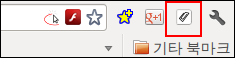
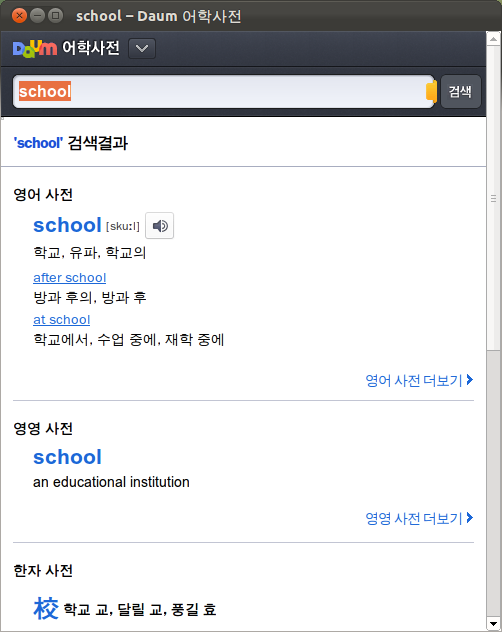

 clipdic 이라고, 클립보드를 감시하고 있다가 새로운 단어가 클립보드에 들어오면 바로 인터넷 사전에서 검색해주는 프로그램을 만들고 있었다. 취미 삼아, C\#, Java, Python 버젼으로 만들고 쓰고 있었는데, 이번에 크롬 웹 브라우저 확장 버젼으로 만들어봤다.
 이 [링크](https://chrome.google.com/webstore/detail/agjdiciiahomininjbanepahjidnkddo?utm_source=chrome-ntp-icon "[https://chrome.google.com/webstore/detail/agjdiciiahomininjbanepahjidnkddo?utm_source=chrome-ntp-icon]로 이동합니다.") 를 따라가거나, 크롬 웹 스토어(Chrome Web Store) 에서 clipdic 으로 검색하면 설치할 수 있다.
 설치가 되면 아래와 같이 버튼이 하나 추가되며, 버튼을 클릭하면 팝업이 뜨게되고, 클립보드에 있는 단어를 바로 daum 사전에서 찾아서 보여준다.

 

 영어문서를 볼 때, 궁금한 단어를 더블 클릭하거나, 드래그 한 후, ctrl+c 만 누르면 바로 단어를 검색해주니 꽤 쓸만하다~ 그리고 크롬 확장이지만, 클립보드를 체크하기 때문에, MS Word 의 문서를 보면서라든지, adobe pdf reader 를 볼 때라든지도 사용 가능하다.
 ps : 참고로 이걸 크롬 확장으로 만든 이유는, 웹 브라우저와 연동하면서 윈도우즈, 리눅스 동시에 돌아가는 프로그램을 C\#, Java 로 만들었을 때 (가능하지만, 개발 및 설치 등이)제법 까다롭기 때문이다.... 자세한 설명은 생략 ㅋ
 
