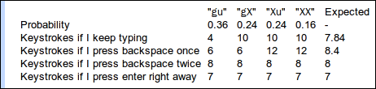

2012 google codejam round 1A : <http://code.google.com/codejam/contest/1645485/dashboard>

**대회 후기**

 오전 8시 30분에 시작인 줄 알고 8시에 겨우 일어났는데 10시부터 시작이었다 -\_-;;; 뭐 여튼 잠도 좀 깨고, 새로나온 구글 드라이브 구경 좀 하다가(WeVideo 라는 app 이 참 좋더라 -0-) 10시부터 시작했다.

 역시나 문제의 정확한 해석이 힘들었다. 여태까지 영어를 대략적인 의미로만 파악하다가 조동사 하나 하나가 중요한 **'문제'**를 풀려니 ㅠㅜ 1번 문제의 의미를 파악하고 나니 30분이 지났다. 나중에 확인해보니 round 1A 1등한 사람은 2번 large 문제까지 다 푼 시간... 난 무엇을 하고 있는것인가 ㅠㅜ

 round 1 은 A,B,C 3개 각 round 의 1000등까지를 round 2 로 보내준다. 난 1번 small 문제 겨우 풀고(문제 해석에 30분, 문제 풀이에 1시간 30분이 걸림 ㅠㅜ)

 20점(1번 small, large 둘다 풀면)이면 3000등 안에 드는데, 난 10점. 뒤에서 100등 ㅠㅜ. large 문제는 맞췄다고 생각했는데 2가지의 실수를 했다. 소수점 계산을 하는데 float 을 쓴 거랑 재귀함수(recursive function)로 문제를 풀었다는 것. 소수점 나오면 무조건 double 을 써야하고, 재귀함수는 for loop 과 배열로 계산했었어야 했다. 다음번에는 실수하지 말자 ㅠㅜ

 일단 추후의 대회나, 처음 (취미로) 코드잼을 시작하는 사람을 위해 구글 문서(https://docs.google.com/document/d/1gfJrZdn\_dOxwL3cyfYw7iqezsuyI89SnB0yY-pxNoZU/edit) 하나 만들어 둔다. 계속 정리하고, 보완할 예정~

**문제 내용**

2012년 Google Codejam round 1 A - Password problem

(의역을 좀 함)키보드를 안보고 암호를 입력하는데, 특정 키를 제대로 잘 누를 확률이 주어진다. 그리고 암호를 입력 도중 어느 순간 이후로는 키보드를 보면서 제대로(!) 입력을 했을 때, 최소 몇번을 눌러야 암호를 제대로 입력할 수 있을까의 문제이다.

 좀 더 풀어보면, 현재까지 입력한 암호의 자리수와 전체 암호의 자리수, 그리고 각 자리의 키를 잘 입력할 확률이 주어졌을 때, 가장 작은 expected 값을 구하는 것이다. expected 값은 특정 상황에서 몇번 더 키를 입력해야하는지에 대한 값이며, 다음과 같이 구할 수 있다. 단, 현재 상황에서 '백스페이스키로 한자리를 지우거나', '엔터키로 현재 입력을 그냥 넣어서 틀리고 다시 더 입력할 수 있다', 그리고 '현재 상황 이후의 모든 입력은 100% 제대로 입력한다', '백스페이스, 엔터키는 키를 한 번 더 입력한 것으로 취급한다' '특히 암호를 다 입력한 마지막은 항상 엔터키를 입력한다'

 만약 암호가 "guest" 이고 현재 2자리의 암호를 입력했고, 첫번째 자리를 제대로 입력할 확률이 60%, 두번째 자리도 60% 라면, 위와 같이 expected 값을 구할 수 있다. "gu" 는 제대로 "gu" 를 입력했다는 뜻이고, "gX" 는 "g" 는 제대로 입력했고, "X" 는 "u" 를 입력해야하는 자리에 다른 글자를 입력했다는 뜻이다.

 위의 그림은 다음과 같은 입력값과 출력값을 가지게 된다.

입력:

2 5

0.6 0.6

출력: 

7.0

 "guest" 는 5개의 글자이고, 현재까지 입력된 문자는 2개 이므로, "2 5" 로 한 줄 입력을 받게 되고, 첫째 자리를 제대로 입력할 확률이 60% -&gt; 0.6, 두번째 자리도 60% 이므로 0.6이 된다.

 그리고 위의 그림에서 Expected 값이 가장 작은 값이 7 이므로, 7.0을 출력하게 된다.

 위의 그림을 좀 더 분석해보면, Probability "gu" 는 첫째자리도 맞고, 둘때자리도 맞으므로 0.6 \* 0.6 = 0.36 의 확률이다. "gX", "Xu", "XX" 는 마찬가지.

 Keystrokes if I keep typing 은 현재 "gu", "gX" 등을 입력했는 상황에서 각각 몇번 더 키를 입력해야 암호를 맞출 수 있다는 것이다. "gu" 가 4 인 이유는 e,s,t,엔터 를 더 입력하면 되므로 4번. "gX" 는 e,s,t,엔터 입력하면 암호가 틀리게 되므로 여기서 다시 g,u,e,s,t,엔터 를 입력해서 4번+6번해서 10번이다.

 Keystrokes if I press backspace once 중 "gu" 는 백스페이스,u,e,s,t,엔터 이므로 6번. "Xu" 는 백스페이스,u,e,s,t,엔터 하면 암호가 틀리므로 다시 g,u,e,s,t,엔터. 그래서 6번+6번해서 12번 이런식이다.

 Keystrokes if I press enter right away 는 모두 7 인 이유가 엔터를 바로 넣어서 현재 입력중인 암호는 틀려버리고 다시 g,u,e,s,t,엔터 해서 1번+6번 = 7번이다.

 아... 다시 적어보니 이것도 쉬운 로직은 아니구나 ㅋ

** 문제해결과정**

 이 문제를 저렇게 진짜 테이블을 다 그리려고 하니 머리가 아프기도 하고, 저 테이블을 진짜로 그리려면, large 문제를 도저히 해결할 수 없겠다는 생각이 들었다(large 문제는 암호의 길이가 10만이므로 이것을 제곱한 만큼 하려면 도저히 풀 수가 없다..... 사실 10만 제곱이 얼만큼 걸리는가해서 그냥 이중for 를 돌려봤는데 꽤 오래걸림;; 그리고 여기서 다시 10만 번을 돌아야하므로 일단 저 테이블을 그리는 건 포기.

 그래서 다시 손으로 문제를 계속 풀어보기 시작함. 분명히 무슨 규칙이 있을거라는 생각에... 일단은 '가지치기' 가 생각나서, 특정 최소 값을 구하고 나머지는 표를 안 그래도 될 거 같다는 생각을 해봤는데, 결과값이 '계산된 값' 이라서 '어? 그럼 그려야하나? -\_-' 싶었는데 이것도 아니었음.

다시 이런저런 생각을 해보다가 문득 떠오른 것이 '백스페이스를 한번 하면 이전 상태가 된다' 였음. 즉, 현재 입력된 암호가 5개이고, 백스페이스를 한번 입력하면, '입력된 암호가 4개인 상태' 가 된다는 것. 결과적으로는 고등학교 때 배운 점화식 문제;; An = An-1 + 9 같은 ㅋ

 결론적으로는 테이블을 3부분으로 나누어보았다. 

1.  Keep : Keystrokes if I keep typing
2.  Backspace : Keystrokes if I press backspace once twice.......
3.  EnterNow : Keystrokes if I press enter right away

 그래서, 현재 암호의 갯수가 주어졌을 때 Keep 부분, Backspace 부분, EnterNow 부분 중 expected 가 최소인 값을 찾는 것이다.

 Keep 은 간단히 계산이 가능하다. (현재까지 입력한 암호가 맞을 확률 \* 남은 키입력 갯수 + 현재까지 입력한 암호가 틀릴 확률 \* (남은 키입력 갯수)) 이다. 다만, 암호가 맞을 때는 남은 키입력 갯수가 (전체 암호 길이 - 현재까지 입력한 길이 + 1 ) 이지만(엔터가 +1), 암호가 틀릴 때는 남은 키입력 갯수가 (전체 암호길이 - 현재까지 입력한 길이 + 1 ) + ( 전체 암호길이 + 1) 이 되는 것이다.

 Backspace 부분은 나중에 다시~

 EnterNow 부분도 Keep 과 비슷하게 계산할 수 있다. 다만, 무조건 현재 상황에서 엔터이므로 모두가 같은 값을 가진다. ( 1 + 전체 암호 길이 + 1 ) 이된다. +1은 엔터키.

 이렇게 생각해보면 다음과 같은 점화식을 만들 수 있다. N 이 현재까지 입력된 암호의 길이라고 하면, 우리가 원하는 값은 다음과 같이 3개의 값 중 최소값(min) 이다. minimumExpected(N-1) 에 +1 을 하는 이유는 한글자를 지우기 위해서 backspace 를 눌렀기 때문이다.

 minimumExpected(N) = min ( Keep, minimumExpected(N-1)+1 , enterNow )

 점화식에서 항상 등장하는 시작값은, '암호를 하나도 입력하지 않은 상태' 이다. 그러므로 minimumExpected(0) 은 암호 전체 길이 + 1 이다. 마지막의 +1은 엔터.

 정리해보면, N 자리까지 암호가 입력되었을 때는, N-1 자리까지 암호가 입력되었을 때의 값을 구하고, keep, enternow 값을 계산하면 된다. keep, enternow 는 쉽게 확률을 곱하고, 더하면 되고, minimumexpected 는 재귀호출로 구할 수 있다.

 내가 만들어본 소스는 다음과 같다.

> \#include &lt;algorithm&gt;
>
> \#include &lt;vector&gt;
>
> \#include &lt;iostream&gt;
>
> \#include &lt;sstream&gt;
>
> using namespace std;
>
> stringstream emptyOut;
>
> \#define DP\_ON 0
>
> \#if DP\_ON
>
> \#define DP std::cout &lt;&lt; "\[DebugPrint\]:"
>
> \#else
>
> \#define DP emptyOut
>
> \#endif
>
> int getintline()
>
> {
>
>  string data;
>
>  getline(cin, data);
>
>  stringstream s;
>
>  s &lt;&lt; data;
>
>  int ret;
>
>  s &gt;&gt; ret;
>
>  return ret;
>
> }
>
> vector &lt; int &gt; getintvectorline()
>
> {
>
>  vector &lt; int &gt; ret;
>
>  string data;
>
>  getline(cin, data);
>
>  stringstream s, debugstream;
>
>  s &lt;&lt; data;
>
>  debugstream &lt;&lt; "getintvector : ";
>
>  while ( !s.eof() )
>
>  {
>
>  int v;
>
>  s &gt;&gt; v;
>
>  debugstream &lt;&lt; " " &lt;&lt; v;
>
>  ret.push\_back(v);
>
>  }
>
>  DP &lt;&lt; debugstream.str().c\_str() &lt;&lt; endl;
>
>  return ret;
>
> }
>
> vector &lt; double &gt; getdoublevectorline()
>
> {
>
>  vector &lt; double &gt; ret;
>
>  string data;
>
>  getline(cin, data);
>
>  stringstream s, debugstream;
>
>  s &lt;&lt; data;
>
>  debugstream &lt;&lt; "getintvector : ";
>
>  while ( !s.eof() )
>
>  {
>
>  double v;
>
>  s &gt;&gt; v;
>
>  debugstream &lt;&lt; " " &lt;&lt; v;
>
>  ret.push\_back(v);
>
>  }
>
>  DP &lt;&lt; debugstream.str().c\_str() &lt;&lt; endl;
>
>  return ret;
>
> }
>
> vector &lt; double &gt; probabilities;
>
> double expected(double currentTyped, double totalCharacters)
>
> {
>
>  if ( currentTyped == 0 )
>
>  {
>
>  return totalCharacters + 1.0;
>
>  }
>
>  double expected\_previous = expected(currentTyped-1, totalCharacters) + 1;
>
>  double keepTyping = 0.0f;
>
>  {// calc keep
>
>  double all\_ok\_probability = 1.0;
>
>  for ( int i=0; i&lt;currentTyped; ++i )
>
>  {
>
>  all\_ok\_probability \*= probabilities\[i\];
>
>  }
>
>  keepTyping = all\_ok\_probability \* (totalCharacters-currentTyped+1.0);
>
>  keepTyping += (1.0-all\_ok\_probability) \* (totalCharacters-currentTyped+1.0+totalCharacters+1.0);
>
>  }
>
>  double enterNow = 1.0 + totalCharacters + 1.0;
>
>  double min = expected\_previous &lt; keepTyping ? expected\_previous : keepTyping;
>
>  min = min &lt; enterNow ? min : enterNow;
>
>  return min;
>
> }
>
> void doOperation(int caseNo)
>
> {
>
>  vector &lt; int &gt; singleline = getintvectorline();
>
>  int A\_currentTypedCharacters = singleline\[0\];
>
>  int B\_totalToTypeCharacters = singleline\[1\];
>
>  probabilities = getdoublevectorline();
>
>  double min = expected(A\_currentTypedCharacters, B\_totalToTypeCharacters);
>
>  cout &lt;&lt; "Case \#" &lt;&lt; caseNo &lt;&lt; ": ";
>
>  cout.setf(ios::fixed);
>
>  cout.precision(10);
>
>  cout &lt;&lt; min &lt;&lt; endl;
>
> }
>
> int main(int argc, char \* \[\])
>
> {
>
>  DP &lt;&lt; "Start testing..." &lt;&lt; endl;
>
>  int numberOfCase = getintline();
>
>  for ( int i=0; i&lt;numberOfCase; ++i )
>
>  {
>
>  doOperation(i+1);
>
>  }
>
>  return 0;
>
> }
>
 그리고 이번 round 에서 1등한 사람의 소스는 다음과 같다. 

> \#include &lt;cstdio&gt;
>
> \#include &lt;iostream&gt;
>
> using namespace std;
>
> double p\[100001\];
>
> main() {
>
>   int T, A, B, prob = 1;
>
>   for (cin &gt;&gt; T; T--;) {
>
>     cin &gt;&gt; A &gt;&gt; B;
>
>     for (int i = 0; i &lt; A; i++) cin &gt;&gt; p\[i\];
>
>     double ret = 2+B;
>
>     double pr = 1.0;
>
>     for (int i = 0; i &lt;= A; i++) {
>
>       ret = min(ret, pr \* ((A-i)+(B-i)+1) + (1-pr) \* ((A-i)+(B-i)+1+B+1));
>
>       pr \*= p\[i\];
>
>     }
>
>     printf("Case \#%d: %.10lf\\n", prob++, ret);
>
>   }
>
> }

 역시 코드잼은 위와 같이 짜는 것인가보다 ㅠㅜ  (그리고 내가 만들어놓은 유틸리티 함수들은 다 쓸모없는 거였;; ) 참고로 이전 구글 코리아 코드잼 대회도 1등의 소스를 보면 한 화면을 넘어가지 않더라;;

  남의 코드를 보면 이해는 힘들지만 배울 점이 많다. 군더더기 없는 깔끔한 코드 +\_+ 나는 재귀호출을 통해서, N, N-1, N-2 를 구해가는데, 처음부터 1,2,3 으로 시작해서 배열에 넣고 있다. 나도 다음부터는 저렇게 배열로 해야겠다 큭

 large 입력에 대해 속도를 비교해보면.... 처참하다 ㅋ 그래도 나도 문제를 풀었다구!!!! 라고 위안삼아본다.

