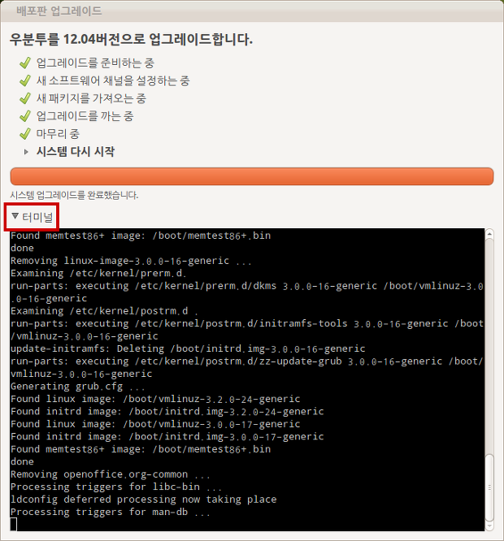

어제 저녁에 우분투 11.10 에서 12.04 로 업그레이드를 했다. 업그레이드에 대한 후기를 적어본다. 실시간으로 google plus 에 올렸던 것을 정리도 할겸~

**업그레이드 환경**

OS : 64bit ubuntu 11.10 커스터마이징 거의 안한 상태

RAM : 12GB

CPU : i7 2.8GHz

GPU : GeForce GTS 250

APT Repository : daum

LAN : 평균 1메가/초 속도

 위와 같은 환경에서 업그레이드 시작. 업그레이드 시작 전에 11.10 에서의 최신 업데이트는 다 한 상태.

**업그레이드 과정**

업그레이드를 시작하면 새로운 패키지를 다운받는데, 약 30분 정도 걸렸음.

새로운 패키지를 설치하는데, 설치 시작 부분 - libc-bin 패키지에서 설치 과정이 멈췄음. 그래서 혹시나하고 아래 사진의 빨간 네모 부분을 클릭해서 보니, 'libc 를 업그레이드 하기 위해서는 특정 서비스들을 재시작해야한다. 확인하세요' 이런 내용을 띄우고 멈춰있었음. 그래서 터미널을 클릭하고, tab -&gt; enter 눌러서 계속 진행시킴(아래 사진은 그 부분은 넘어간 터미널 화면). 이거 안 눌러봤으면 업그레이드 프로그램이 뻗었는 줄 알았을 듯;;

 여튼 설치 시에는 꼭 터미널 열어놓고 진행 강추~!

 업그레이드 과정 중에 꽤 많은 32bit 전용 라이브러리 들이 제거됨을 알려줌. 아마 64bit 전용으로 대체되는 것 같은데, 이것 때문인지 체감 속도가 좀 빨라졌음.

 패키지 업그레이드 과정은 약 30분 만에 종료. 총 설치 시간은 넉넉잡아 1시간 30분 정도 걸린듯.

 업그레이드 후 재부팅. 부팅은 잘됨. 다만 부팅 후 잘 사용 중이던 무선 마우스가 인식이 안되어서, USB 리시버를 뺐다가 다시 연결하니 잘 동작함.

**12.04 기본 사용 소감**

'체감할 수 있을 정도로 속도가 빨라짐' 노틸러스(파일 탐색기) 창을 잡고 이리저리 흔들었을 때 11.10 보다 확실히 반응이 빠름

이전 버젼의 한글 번역 '깔기' 가 '설치' 로 돌아와서 (개인적으로 매우) 좋음

기본 글꼴이 '나눔고딕' 이 되어서 인지, 전반적으로 한글이 깔끔해짐(네이버 매우 감사~)

11.10 에서의 ibus 버그 때문에한글IME 로 나비를 쓰고 있었는데 다시 ibus 로 돌아와서, 시작시 '한글 패널' 이 없어서 좋음

MyUnity 프로그램에서 이것저것 unity 설정할 수 있어서 좋음(마운트된 드라이버를 unity 에 안 보이게 해줘서 좋음)

**결론**

 총 설치 약 1시간 30분 정도 걸림

 전반적으로 속도 향상이 있음

 업그레이드는 꽤 잘됨

 11.10 이라면 12.04 로 무조건 추천하고 싶을 정도(사실 안할 이유가 없잖아!! LTS 이기도 하고 ㅋㅋ)

