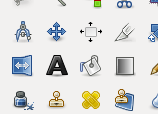
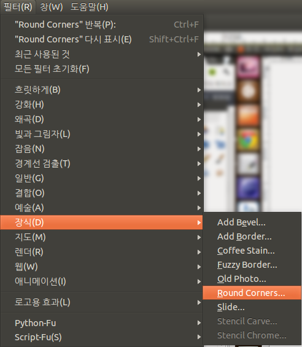
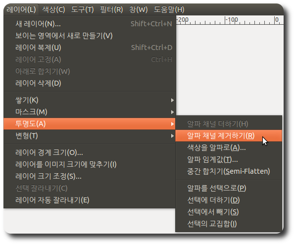

김프에서도 포토샵과 마찬가지로 다양한 필터를 제공하는데, 그 중에 Round Corner 는 다음과 같은 효과를 주어서 스크린샷 등을 첨부하거나 할 때 꽤 멋진 효과를 줄 수가 있다.

  

위의 이미지를 아래의 Round Corner 를 적용하면,

아래의 이미지가 된다.

 그런데 김프를 사용하다보면, 필터 -&gt; 장식 -&gt; Round Corner 가 비활성화(disabled)되어 사용할 수 없는 경우가 있다. 특정 필터들은 특정 조건이 만족되어야만 사용할 수 있는데, Round Corner 의 경우 알파 채널(Alpha Channel)이 존재하면 사용할 수가 없다. 그러므로 Round Corner 를 사용하려면 알파 채널을 제거해줘야 한다.

 알파 채널을 제거하려면, 레이어(Layer) -&gt; 투명도(Transparency) -&gt; 알파 채널 제거하기(Remove Alpha Channel) 를 하면 된다.

ps : 이 블로그가 김프 관련 블로그는 아니지만, round corner 를 사용하여 작업 중 이상하게 동작하지 않을때가 있어서 검색해봐도 내가 원하는 답이 없었는데, 다행히 알파 채널이 문제란 걸 알아내서 올려봄~

