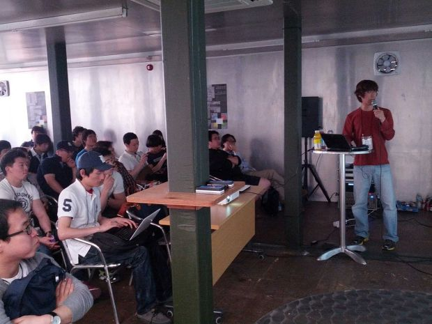
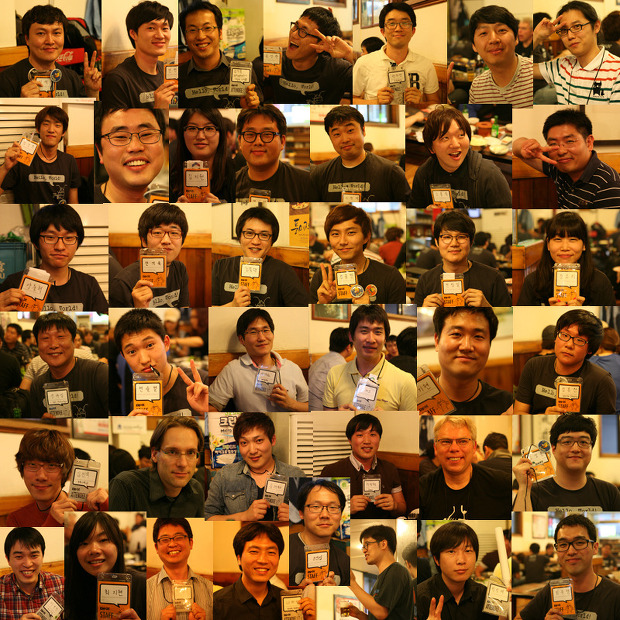

출처 : @FlaShilver 님 트윗 - <https://twitter.com/#!/FlaShilver/status/201168005038743552/photo/1>

2012년 5월 12일 DevFestXKorea 라는 개발자 모임에서 발표를 하였습니다. 구글 코리아에서 후원을 하고, 여러 구글 기술 관련 그룹에서 주최를 하여, '구글 기술을 사용하는 개발자 모임' 정도 되겠습니다.

 여기서 얼마전에 만들어서 공개했던 ClipDic 내용을 가지고, **'ClipDic 개발 사례로 보는 크롬 확장 프로그램 개발'** 이라는 제목으로 발표를 했습니다.

 <a href="https://docs.google.com/presentation/d/1e7F8lWyYH6aTNpnrl63_R3OlnjOWWYISr0kOPKBc-Xg/edit" class="tx-link">[ 발표 자료 링크 - 구글 문서 링크 ]</a>

 크롬 확장 프로그램의 Hello World 로 시작해서, 어떤 과정과 API 들을 사용해서 만들었나, 그리고 배포/업데이트를 소개합니다. 발표 중에도 계속 말했지만, '정말 쉽고, 재미있습니다' 한번씩 해보시면 공감하실 겁니다~

 DevFestXKorea 는 원래 구글의 기술에 관심이 많은 저였지만, 그동안 개발자 모임에는 한번도 참석해본 적이 없는데, 이렇게 발표를 하게 된 이유는... 꼭 참석하고 싶었기 때문입니다 ㅋ 원래 꼭 참석하고 싶다는 생각만 하고 있었는데, 일반 참석자로 신청하면, 선별을 한다고 하더라구요;;; 근데 발표자로 신청을 하면 발표자 선정이 안되어도 100% 참석자로 해준다고 해서, 발표자로 신청했습니다 ㅎㅎ 다행히 발표할 꺼리(ClipDic)도 있고해서 발표 신청을 했습니다. 크롬 확장 프로그램 소개 정도로 시작했기 때문에 스크린샷 위주로 쉽게 발표를 해서, '아~ 꽤 쉽구나' 라는 내용은 제법 전달된 것 같습니다. 아마 '뭐 저런걸로 발표를 했나...' 라고 하실지도 ㅠㅜ

 DevFestXKorea 에 가기 위해 경북 구미에서 새벽 3시에 일어나서(ㅠㅜ) 열심히 서울로 올라갔습니다. 플래툰 쿤스트할레라는 멋진 모임 자리에 10시 40분쯤 도착했는데... 역시나 처음 간 개발자 대회... 어색했습니다 ㅋ 등록하고 이름표 목에 걸고, 들어갔는데 좀 뻘쭘했습니다. ㅋ 그나마 많은 사람들이 모여있는 곳 근처(;;)에 앉아서 이런 저런 대화를 잠시 듣다가 제 소개를 할 때쯤 장내 정리가 되면서 키노트 준비;;; (아 나도 대화에 끼고 싶었는데;;) 그렇게 시작했는데, 음료수를 하나 마시러 (무료)Bar 에 갔더니 거기에 제가 아는 친구가 Staff 로 있는게 아니겠습니다. 둘다 서로 깜짝 놀라서 얘기 좀 하다가, 온라인에서만 알고 지내면서 꼭 한번 만나고 싶던 한정일님도 만나고... 그렇게 어색했던 모임이 조금씩 덜 어색해지기 시작했습니다.

 '개발자에게 희망을~' 이라는 메시지의 권순선님의 키노트 후 점심을 먹으며, 저에게 말을 걸어주신(!) 다른 분과 샌드위치 먹으며 얘기 좀 하다, 발표 준비를 위해 3층으로 올라갔습니다. 약간의 문제가 있었지만, 다행히 제가 가져간 노트북으로 발표를 하게 되었습니다. 제가 2번째 발표여서 1번째 발표를 들으면서 그나마 여유가 있어서 제 발표 준비는 잘되었습니다. 참고로 발표자 컴퓨터가 크롬북이었는데 프리젠터랑 미러링이 안되어서, 맥북으로 교체했는데 제가 잘 못써서 그냥 제 노트북으로 발표;; 크롬북을 처음만져봐서(20초쯤?) 감동이었는데, 서울에서는 정말 맥북을 많이 쓰는거 같아서 또다른 세상이었습니다(저도 마음만은 특별시!! 인데 말이죠 ㅋ)

 첫번째 발표는 크롬 개발자 도구의 고급 사용법이었는데, 정말 관심도 있었고, 저에게 딱 필요한 내용들이었습니다. 아무래도 저도 취미 프로젝트에 웹 기술 관련이 많으니 많은 도움이 되었습니다.

 두번째는 제 발표였고;;

 세번째는 GWT 와 앱 엔진. GWT 는 안 쓰고 있는데, 그래도 앱 엔진 관련 내용이라 재미있게 들었습니다.

 네번째는 Hello Dart. 전에 동영상 한번 정도 본 것이었는데, 꽤 흥미롭게 소개를 잘 해주셨습니다.

 다섯번째는 Dart 를 활용한 Presentation tool 소개. 얼마나 간단하게 내용을 채울 수 있는 툴인지는 모르겠지만, 짧은 시간에 정말 간결하게 소개해주셨습니다.

 여섯번째는 Google App Engine 활용기. 저랑 비슷한 게임업계에 계시고, App Engine + Python 으로 개발하셨는데, 제가 개발중인 WimyBox(<a href="http://box.wimy.com/" class="uri" class="tx-link">http://box.wimy.com/</a>)와 거의 비슷한 기술 체계여서 정말 흥미로웠습니다. 저와 같은 환경에 저와 같은 취미 프로젝트. 그리고  제가 특히 공감갔던, 해결방법들(referer 수정 같은 코드)을 보니 저와 비슷하게 여러 관문들을 여러개 통과하셨다는 느낌이 많이 들었습니다. 그리고 유쾌한 발표와 진행이 저의 마음을 많이 끌었습니다. 나중에 발표자인 '나자영' 님과 많은 얘기를 나눴는데 공감대가 많은 만큼 재미있는 얘기 많이 나눌 수 있었습니다.

 일곱번째는 Google Apps Script 활용. Apps script 는 저의 딸 '나윤이' 의 이름을 지을 때 사용하고, wimy.com 도메인의 관리 때문에 몇년간 사용 중이어서, 역시 흥미롭게 들었습니다.

 마지막 여덟번째는 Google App Engine 의 발전 방향과 이를 응용한 소프트웨어 개발. Google App Engine 으로 스타트업을 하고 계셨던 분의 발표였는데, 정말 '전문가'의 내용으로 발표해주셨습니다. 많은 얘기를 나눠보고 싶었는데, 아이가 아파서 급하게 가셨다는 ㅠㅜ 너무 아쉬웠습니다.

 DevFestXKorea 에는 총 3개의 트랙(Web & Cloud, Mobile, Emerging)이 있었는데 저는 계속 Web & Cloud 만 들었습니다. 다른 트랙들도 관심이 있었는데, 이제 하나씩 살펴볼 예정~

 모든 발표가 끝나고 특정 주제에 관심있는 사람들끼리 smalltalk 를 했는데 저는 제 발표 주제인 크롬을 버리고;; App Engine 으로 가서 재미있는 얘기를 많이 나눴습니다.

 사실 개발자 모임에 처음가면서 조금 막연한 기대를 가지고 있었는데, 좋은 발표를 듣고, 즐거운 분들과 만나고, 개발자로써의 자극을 제대로 얻어서 갑니다. 그리고 뒤풀이 시간에서의 많은 즐거운 대화, 공감대. 정말 멋진 경험이었습니다. 그리고 건배 제의를 'Hello~ World~' 로 하는 진짜 개발자 분위기가 너무 마음에 들었습니다. 그리고 저도 어느새 개발 10년차가 되는데, 우리의 미래, 희망인 젊은 개발자분들과 함께 얘기할 시간이 있어서(많이는 못했지만;;) 즐거웠습니다.

 발표 자료를 트위터와 구글 플러스에 공유하고, 리트윗을 받고, 팔로워가 늘고, 제 슬라이드를 많은 사람들이 보고 있고(지금도 4분이나 보고 계시네요), 아무도 관심이 없던 clipdic 을 벌써 fork 하신 분도 있고, 마치 개발자 세상에 데뷔를 한 기분입니다. ZViewer(http://zviewer.wimy.com/)는 소스 공개를 한지 7년쯤 될 동안 딱 2번 패치를 받았는데;; 여튼 정말 좋은 경험을 해봅니다.

 행사 준비해주신 많은 분들께 감사드리며, 행사에 와서 함께 즐겨주신 많은 분들께도 감사를 드립니다. 앞으로도 즐거운 모임에서 많이 만났으면 합니다~~~ 개발자 여러분들 화이팅입니다~

출처 : 이원제님 구글 플러스 - <https://plus.google.com/107621265594457706915/posts/VsvLVVgLGKG>

 

