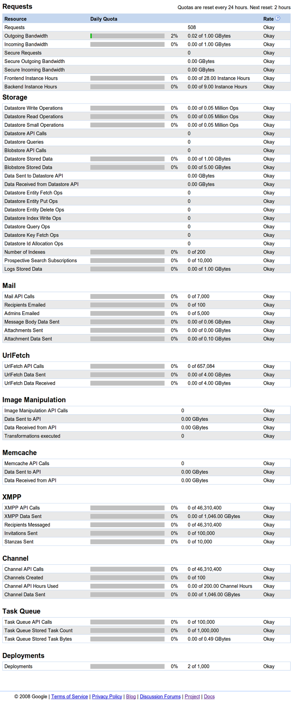

 얼마전 DevFestXKorea 의 smalltalk 시간에 appengine 관련 모임에 참여하면서 사람들이 궁금해하는 몇가지를 정리해보려고 합니다. 참고로 저는 취미로 WimyBox(<a href="http://box.wimy.com/" class="uri" class="tx-link">http://box.wimy.com/</a>)를 Google App Engine(GAE) 으로 개발하고 있으며, 하루에 약 900명 정도의 인원이 방문하고 있습니다.

** - 왜 Google App Engine(GAE) 을 사용했나요?**

 무료라서 입니다;;; 아마 취미로 개발하신 분들은 대부분 비슷할 것 같은데, 어느 정도의 서비스까지는 무료로 제공됩니다. 그리고 무료로 서비스를 구축해 놓고, 서비스가 잘되겠다 싶으면, 클릭 몇 번해서 최대 부하량을 늘리면서 정식 서비스를 하면 됩니다. 정식 서비스라 함은, 서버 사용량이 많아짐(광고를 하든지, 널리 알리면 사용자가 늘겠죠?)을 뜻합니다.

** - 얼만큼의 무료 서비스 인가 - free quota**

 무료로 제공되는 서비스의 종류는 다양한데, 이를테면, 서버 CPU 는 28시간이 제공됩니다. 하루에 약 28시간의 CPU 시간이 제공되는거죠. 하루는 24시간인데, 어떻게 28시간을 다 쓰냐하면, 서비스에 부하가 걸리면 instance 가 2개로 늘어납니다. 그러면 그 때부터 시간은 x2 배로 가는거죠;; 물론 무조건 1개의 instance 만 동작하도록 설정할 수도 있습니다. 혹은 좀더 빠른 CPU 로 세팅을 바꾸면 1개의 instance 가 x3 으로 시간을 잡아먹는등(서비스 반응 속도는 빨라지겠죠), 세팅에 따라서 조금 다릅니다. 무료 DB 저장은 하루에 1기가를 제공해줍니다. Outgoing Bandwidth(내려받기 대역폭)은 하루에 1기가를 제공해줍니다. 메일 발송은 하루에 100개가 무료입니다.

 이런식으로 무료 용량이 제공됩니다. 그러므로 어떤 종류의 서비스를 기획하느냐에 따라서 무료로 사용가능할 지가 결정됩니다. Database 에 하루에 1기가 이상을 저장하는 \[ 이미지 저장 및 열람 \] 서비스는 이미지를 작게해서 저장하는 종류가 아니라면 좀 힘들 수도 있겠죠. 어떤 메일링 리스트 처럼 동작하는 서비스는 아마 시작도 힘들거 같습니다.

 WimyBox 의 경우 database 를 거의 쓰지 않고, 최신 곡 목록을 가져오는 부분만 한시간에 한번씩 urlfetch(다른 웹사이트의 페이지를 가져오는 함수) 를 통해서 가져오고 있습니다. urlfetch 는 하루에 657,084 번 실행할 수 있으며, 하루에 4기가의 데이터를 사용할 수 있습니다.

 간단히 말씀드려서, 개발 테스트 용도로 하기에는 부족함은 없습니다. 아래의 free quota 관련 이미지를 참고하세요~

** - 어떻게 서비스를 구성하는 게 좋을까**

 WimyBox 의 경우 사용자가 늘어나면 urlfetch 를 많이 사용했었는데, 한 시간에 한번만 urlfetch 를 사용하고 결과를 저장해두고, 한시간 안에는 캐시를 통해서 동작하도록 수정하여 urlfetch 횟수를 많이 줄였습니다. 그리고 urlfetch 자체가 CPU 시간도 많이 사용하므로 CPU 시간도 줄일 수 있습니다. 최근에는 html5 의 appcache 를 이용하여, html/css/js 파일을 한번이라도 새로운 버젼을 다운받았으면 다시 다운 받지 않도록 하여 조금이나마 사용량을 줄였습니다.

 만약 image 저장을 하려면 용량을 좀 줄여서 저장한다던지, 가능하면 image 의 url 만 저장한다던지 등을 하면 좋을 것 같습니다. 혹은 다른 무료 image storage(flickr 나 google picasa 등)에 저장하는 것도 한 방법이 될 수 있습니다.

 이런식으로 최대한 어떤 자원(CPU, 용량제한 등)의 사용을 최대한 줄여두면 좋습니다. 주기적으로 Dash board 를 확인하여 어떤 자원을 많이 쓰는지를 확인하여, 어떻게 해당 부분의 부하를 줄일 수 있을지 고민해보는게 좋을것 같습니다.

 그리고 무료 용량 제한에 걸리면, 여러 무료 서비스(한 계정당 11개의 서비스를 만들 수 있음)를 만들거나, 다른 계정을 만들어서 부하를 분산시키는 것도 고려할 수 있습니다. 다만, 관리가 좀 더 힘들어지겠죠;;

** - 어떤 개발 환경인가**

 OS 로는 windows/linux/mac 을 지원합니다. 개발 언어로는 java/python/go(beta) 를 지원합니다. 저는 linux-python 조합으로 사용 중이긴 합니다. Java 의 경우 GWT(Google Web Toolkit)라는 것을 통해 좀 더 쉬운 web UI 를 제공해주시도 합니다.

 - 그 외

 아마존의 AWS(Amazon Web Service)는 아직 제가 사용해보지를 않아서 정확한 비교는 할 수 없지만, 일단 일년의 무료 사용은 가능하다고 합니다만 저는 취미 개발을 일년만 할 것이 아니라서 App Engine 을 사용합니다;;

 image, css, javascript, html 등의 static 파일은 CPU 를 소비하지 않고, Outgoing bandwidth 만 소모합니다(image 만 따로 서비스하는 서비스를 구성해본 결과) 다만 조금 큰 이미지라면 google sites 에 올려놓고 서비스하는 게 좋을 것 같습니다.(조금이라도 서비스 자원을 아끼기 위해)

 Database 를 사용하려면  일반 db 보다, ndb 를 사용하세요. 새로운 db 니까;;

 국내향 서비스의 경우 GAE 가 AWS 보다 반응속도가 느린 감이 있다고 합니다. 구글에서 데이터센터를 한국에 두지 않는 이상 이 부분은 어쩔 수 없을 것 같습니다. 그런데, 숫자로 보는게 아니라 체감을 해보면, box.wimy.com 도 느리다는 생각은 들지 않습니다. 이 부분은 사실 주관적으로 다르기도 하니;; 지금 체크해보니, 47kb 짜리 이미지 로딩하는데, 302ms(0.3초) 걸리네요.

  한국 App Engine 관련 페이스북 그룹 - <https://www.facebook.com/groups/GAEKorea/>

 

 

