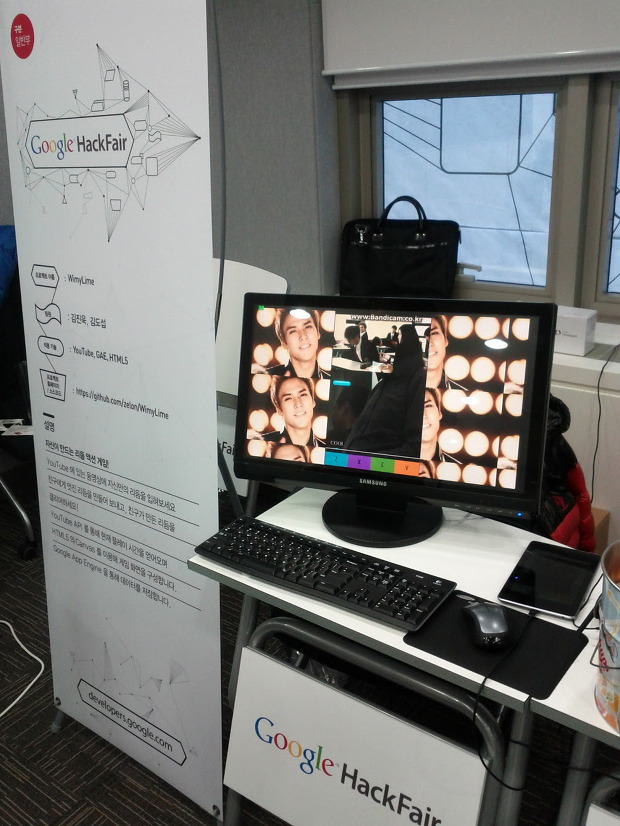
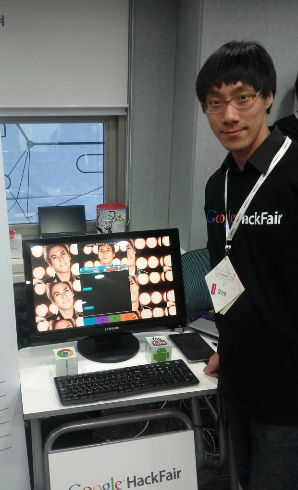
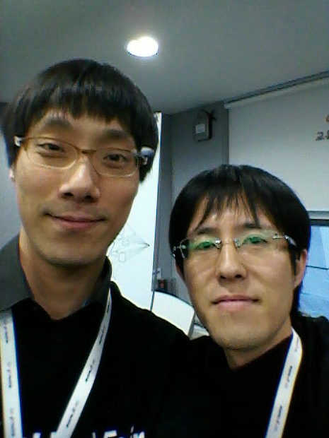

 얼마전 구글 코리아 주최의 핵페어가 있었다.(<a href="http://googlekoreablog.blogspot.kr/2012/11/google-hackfair_6.html" class="uri" class="tx-link">http://googlekoreablog.blogspot.kr/2012/11/google-hackfair_6.html</a>)

 난 평소에 wimybox 를 만들면서 생각했던 아이디어로 WimyLime(<a href="http://lime.wimy.com/" class="uri" class="tx-link">http://lime.wimy.com/</a>)이라는 프로젝트로 참여를 했다. 바로 YouTube 에 있는 뮤직 비디오들에 리듬 액션 게임 요소를 넣어서 게임을 만들면 어떨까라는 생각! 리듬 액션 게임을 한번 만들어볼 생각은 전에도 했었지만, 음악과 리듬을 구하는게 쉽지 않아서, 음악은 YouTube 에 있는 공식 뮤직비디오들을 가져오고, 리듬은 직접 쉽게 입력할 수 있으면 어떨까해서... 시작했다.

 평소에 매우 조금씩 만들어오던 것을 시간을 조금 더 투자해서 제출해보았고, 다행히도 전시작품으로 선정되었다.

 경북 구미에서 직장 생활을 할 때는, 개발자로써의 공식 활동(?)이라는 것을 블로그에 글을 쓰는 것 정도였는데, 수도권으로 직장과 집을 옮기면서, 지난 Google DevFest 후 다음 행사인 듯한 Google Hackfair 에 참가할 수 있었다. (역시 사람은 서울로...;; )

 17일~18일 동안 내 작품의 부스를 지키면서 약 200명 정도한테 설명을 했던 것 같다. 장점은 뭐고, 타블렛에서도 되고 등등... 좀더 관심을 가지는 분들은 직접 플레이도 해보시고, 리듬도 만들어 보시고, 어떤 분은 라운지의 PC 에서 리듬을 만들었다고 오신 분도 계시고, 명함을 주시는 분, 사업화에 대한 질문을 하시는 분, 정말 즐기시는 분(!), 개선방향을 제시하시는 분 등 다양한 분들이 오셨었다.

 트위터에도 적었지만, 

> 누군가가 나의 아이디어를 평가해주고 의견도 제시해주고 칭찬도 해주고, 다른 멋진 프로젝트 구경도 하고 기념품도 받고, 업계 사람들도 만나고. 좋은 경험이다~!

 참고로 기념품은 넥서스7, 구글TV, 구글컵, 구글티셔츠, 구글볼펜, 참가 크리스탈, 구글큐브 등등~

 그리고 온라인으로만 알던 분도 만나고, WimyBox 잘 쓰고 있으시다며 같이 사진찍자고 하신분도 계셔서 정말 즐거운 경험이었다. 특히 같은 전시장소에 계시던 분들과는 이런저런 얘기 나누면서 좀더 친해지는 계기도 되었던듯~

 얼마전 포스팅에도 개인 프로젝트의 장점을 적었지만, 개인 프로젝트의 또하나의 기쁨을 느낄 수 있었던 것 같다. 다음에도 재미있는 개발자 대회가 있길~~~

 

 

 

