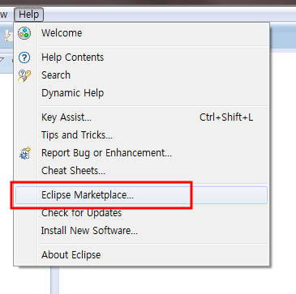
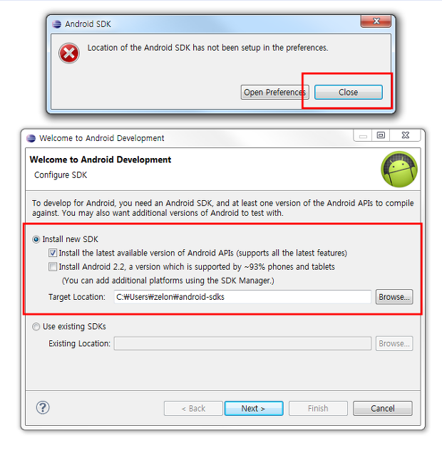
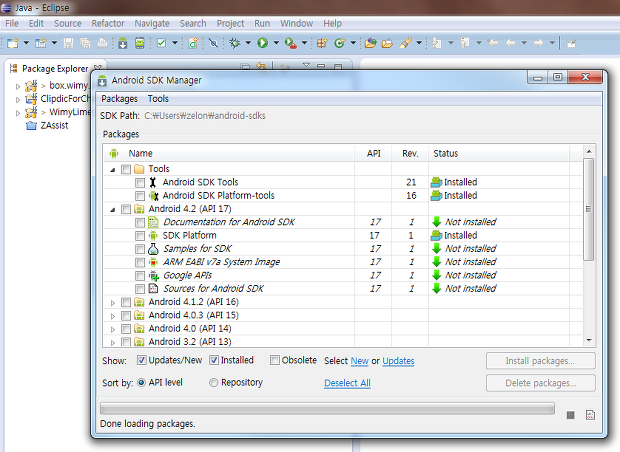

넥서스7이 생긴 바람에 오랜만에 안드로이드 개발환경을 구축할 일이 생겨서 eclipse 에서 설치를 하려고 생각했는데, 가만히 생각해보니 ADT 만 설치하면 ADT 가 sdk 를 설치해준 기억이 나서, ADT 가 왠지 eclipse marketplace 에 있을거 같아서 한번 찾아보니 왠걸(!!!) 있었다. 그래서 설치해보니 매우 잘되어서 포스팅 시작~

 \*\*\* 알고보니 지금은 http://d.android.com/ 에서 eclipse + ADT + SDK 까지 한번에 통합된 것을 받을 수 있네요 ㅠㅜ 아래 포스팅은 그냥 eclipse 가 이미 있을 때 안드로이드 개발환경 쉽게 붙이는 방법 정도로만....(아... 세상 빨리 변하네요 ㅋ) \*\*\*

 일단은 JDK 깔고, eclipse 는 깐다. 이제 ADT 를 주소를 넣고 깔고, SDK 를 다운받아서 설정하고 이런것을 해야하겠지만, ADT 와 SDK 는 아래와 같이 쉽게 설치할 수 있다.

 eclipse 를 띄운 후, 아래처럼 Eclipse Marketplace 클릭

 android 로 검색한 후, 제작자가 Google 인 것을 install~

 중간 설치 과정이야 뻔하게 ok, agree 등을 하고 설치한 후, eclipse 재시작 후 아래 화면에서 Close 하고, Install new SDK 를 선택해서 SDK 를 받아오자.

 아래처럼 Android SDK Manager 를 띄울 수 있게 되면서 안드로이드 개발환경 설치 성공~~!!

 포스팅하기 전에 잠깐 안드로이드 개발환경 글을 검색해보았는데, 너무 예전 글이 많다. 그리고 시중에 있는 안드로이드 책들도 상당히 예전 방법과 예전 환경에서 설치하고 있어서 안타까운 마음이 든다.

** 이렇게 쉽게 설치할 수 있는데!!!!!**

ps : 많이 퍼뜨려주세요...;;

