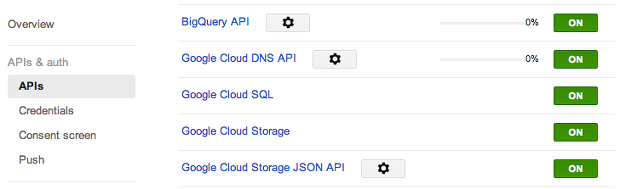

Google에서 Cloud Platfrom 의 일원으로 Cloud DNS(<a href="https://cloud.google.com/products/cloud-dns/" class="uri" class="tx-link">https://cloud.google.com/products/cloud-dns/</a>) 를 발표했다. DNSEver 의 유료화와 비슷한 시기에 발표되어서 관심을 가지고 설정을 해보았다. 난 이미 DNSEver 유료 결재를 해버린건 함정;;

 가격은 현재(2014.04) 25개까지의 zone 을 유지하는데 한달에 zone 하나당 0.2달러. 100만 쿼리에 0.4달러. 나쁘지 않다. DNSEver 와 비교해도 나쁘지 않다 ㅋ 하지만 아직은 설정하기가 DNSEver 가 훨씬 편하다. 아마 google 에서 웹 인터페이스를 곧 제공하지 않을까 예상해본다(이미 API 도 있으니...)

 일단 <a href="https://console.developers.google.com/project" class="uri" class="tx-link">https://console.developers.google.com/project</a> 에서 새로운 프로젝트를 만든 후, 아래의 그림처럼 API 를 열어주자. "Google Cloud DNS API" 를 ON 하려면 enable billing 을 해야한다. 카드 입력하면 1달러 우선 결재 +\_+

이제 구글 Cloud DNS API 를 사용할 준비가 되었으면, 구글 클라우드 SDK 를 다운로드 하자.  <a href="https://developers.google.com/cloud/sdk/" class="uri" class="tx-link">https://developers.google.com/cloud/sdk/</a> 에서 다운로드 하면 된다. 다운로드 후 압축을 풀고, install.sh (리눅스나 맥)나 install.bat (윈도우)를 실행시키자. path 에 설치된 bin 경로를 추가하고 아래의 명령으로 dns 명령을 실행할 수 있게하자.(혹시나 아래의 명령이 기존의 SDK 를 업데이트만 하고 dns components 를 설치하지 않을 수도 있으니 이상하게 명령이 안먹히면 아래의 명령을 다시 한번 실행해보자)

>  gcloud components update dns

 그런 후, 아래 명령으로 간단히 커맨드 로그인을 하고(웹 브라우저가 뜨면서 인증을 물어본다)

> gcloud auth login

 zone 을 생성해보자.

> gcloud dns managed-zone create --dns\_name="example.com." --description="A test zone" examplezonename

 이제 만든 zone 을 edit 해보자.

> gcloud dns records --zone=examplezonename edit

 윈도우에서는 메모장이 뜨고, 맥에서는 vi 로 아래와 비슷한 내용이 편집할 준비가 된다. 이제 여기의 내용을 고쳐서 dns API 에 명령을 보내게 된다. 

> {
>
>     "additions": \[
>
>         {
>
>             "kind": "dns\#resourceRecordSet",
>
>             "name": "wimy.com.",
>
>             "rrdatas": \[
>
>                 "ns-cloud-e1.googledomains.com. dns-admin.google.com. 8 21600 3600 1209600 300"
>
>             \],
>
>             "ttl": 21600,
>
>             "type": "SOA"
>
>         }
>
>     \],
>
>     "deletions": \[
>
>         {
>
>             "kind": "dns\#resourceRecordSet",
>
>             "name": "wimy.com.",
>
>             "rrdatas": \[
>
>                 "ns-cloud-e1.googledomains.com. dns-admin.google.com. 7 21600 3600 1209600 300"
>
>             \],
>
>             "ttl": 21600,
>
>             "type": "SOA"
>
>         }
>
>     \]
>
> }

 위의 내용을 대충 훑어보면, 간단한 형식의 JSON 이다. 일단 내가 이 도메인에 사용할 name server 의 이름이 보이고 additions 에 추가할 내용, deletions 에 삭제할 내용을 추가해서 저장하고 편집기를 닫으면 google dns API 가 저장된 파일을 보고 적절한 명령을 내려주게 된다. additions 에 어떤 형식으로 넣을지는 <a href="https://developers.google.com/cloud-dns/migrating-bind-zone-command-line" class="uri" class="tx-link">https://developers.google.com/cloud-dns/migrating-bind-zone-command-line</a> 를 참고하자. 대부분의 형식을 알 수 있다.

 참고로, JSON 형식을 잘못입력하면(, 를 빠트리면....) 처음부터 다시 입력해야 하므로, 많은 내용을 입력할 때는 다른 메모장을 열어서 사용하거나 vi 의 split 기능을 이용해서 미리 다른 파일에 저장해두자.

 이 포스팅의 내용은 <a href="https://developers.google.com/cloud-dns/" class="uri" class="tx-link">https://developers.google.com/cloud-dns/</a> 의 내용을 간략히 옮긴 것이므로, 추가 사항은 당연히 이 공식 홈페이지를 참고하세요~~ :)

