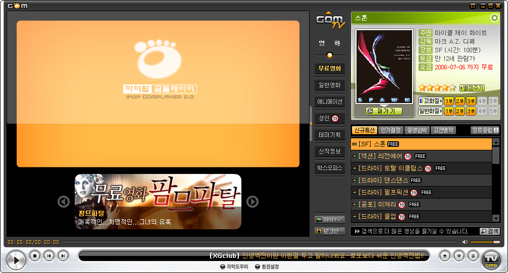

약간 지난 내용이지만,  곰 플레이어가 일반적인 동영상 플레이, 코덱 찾기를 넘어서 동영상 컨텐츠를 제공하기 시작했다.
가장 큰 변화는 '무료 영화' 를 제공하기 시작했다는 거다. '무료 영상' 을 영화라고 보낸 적은 있고, 유저들끼리의 P2P 를 이용한 '불법 영화' 제공은 몇번 있었는것 같지만 라이센스를 체결하여 제대로 '무료 영화' 를 제공하는 것은 처음인듯 하다. 그런데 이 '무료 영화' 라는게 소위 말하는 장난이 아니다. 최신 영화를 줄줄이 다운받아서 보는 매니아들이 아니라면 한번쯤은 놓쳤을만한 영화들이 많다. 특히 개봉된지 조금 시간이 지난 영화이지만 꽤 인기를 얻었던 많은 영화들이 제공되고 있다. 예를 들면, '친절한 금자씨', '주홍글씨', '광복절 특사', '반칙왕', '데스티네이션' 등등 '볼만한' 영화들이 제공된다. 그리고 시간이 지나면 현재의 무료영화들은 유료로 바뀌고 새로운 '무료 영화' 들이 리스트업된다.
게다가 얼마 시간이 지나니 정말 재미있는 컨텐츠들이 업데이트되기 시작했다. 내가 즐겨보는 '스타리그' 방송들을 볼 수 있는 것이다. 꽤 재미있는 발상이다. 그리고 꽤 많은 사람들이 볼 것 같은 'music tank' 같은 것들의 재방송을 볼 수 있다. 그리고 각종 뮤직비디오들도 볼 수 있다.
이정도면 일단 곰 플레이어는 '사람을 모으기' 에는 일단 어느 정도 성공할 것이다. 이제 이 사람들을 가지고 뭘 할 것이냐는 게 문제일 것이다.
항상 기업은 수익 모델이 있어야하는데, 일단 곰 플레이어의 수익 모델은 '광고' 와 '유료 동영상 스트리밍' 으로 보인다.
최근 youtube.com 의 성공과 함께 국내에서는 곰 플레이어가 과연 어느 정도의 성과를 보일것인지가 기대된다.

