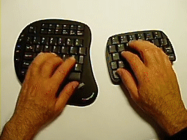

내가 생각하기에 정말 입력장치에 획기적인 선을 긋는 혁명이라 생각하는 입력장치이다.
키보드 + 마우스 조합이 이만큼 편할 수 있을까... 물론 아직 제품으로 나온게 아니라 완성 중인 시제품이라지만 나오면 꼭 써보고 싶은 제품이다.
참고로 오른쪽 키보드의 오른쪽 단면에 감지 센서가 있어서 손가락을 대었을 때 마우스 모드로 들어간다고 한다.
국내 블로그 글 : http://itviewpoint.com/tt/index.php?pl=1493
공식 홈페이지 : http://www.combimouse.com/index.htm

