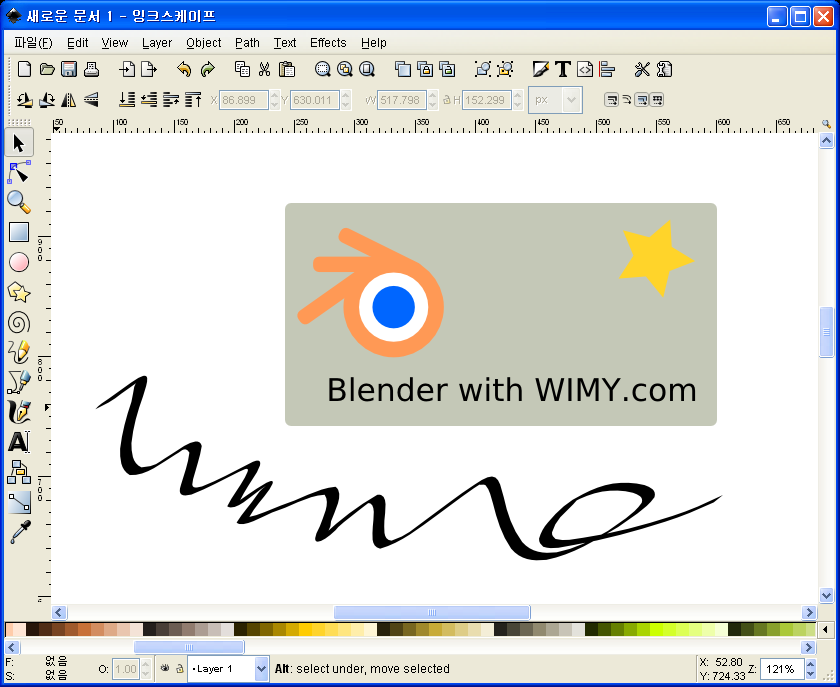

 오픈소스진영의 벡터 그래픽 툴인 inkscape 가 최근에 발전된 모습을 서서히 드러내고 있다. 아래의 스크린샷은 최근에 발표된 0.44 버젼이다.
기존에 한글화가 안된 문제와 함께 다양한 기능의 부재로 무언가 2% 부족한 모습을 보였던 것이 이제 일반인의 눈으로 봤을 때는 꽤나 갖추어질 것이 갖추어진 모습을 보여주고 있다. 특히 한글 버젼에서의 GTK 툴들의 고질적인 문제였던 command window 도 나타나지 않고, 아직 모자란 부분도 있지만 대부분의 기능이 번역되어 있는 상태이다. 그리고 툴 상자가 윈도우에 기본적으로 붙어있는 등, 상용 프로그램의 유저 편의성을 기본적으로 지원하고 있다.
간단히 벡터 기반의 그래픽을 경험해보거나 오픈소스 프로그램을 찾는 유저라면 써보기를 추천한다.

