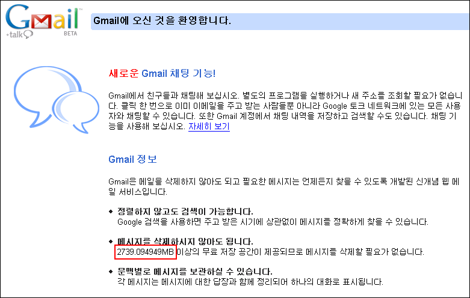

구글에서 런칭한 메일 서비스인 지메일(gmail) 은 다음과 같은 속도로 개인에게 할당된 용량이 계속 증가하고 있다. 이것은 기존의 서비스가 고정된 크기를 제공하고, 시대 흐름에 맞추어서 일괄적으로 용량을 증설하거나 했던 것에 비해 신선한 재미를 준다. 가만히 있어도 1초에 약 4Byte 씩 용량이 늘어나는 메일 계정이라니... 언제까지 늘어날지 지켜보는 것도 재미있을 듯하다.
   1초  0.000004MB 증가
== 1분 0.00024MB 증가
== 1시간 0.0144MB 증가
== 하루 0.3456MB 증가
== 한달(30일) 10.368MB 증가
== 일년 약 126MB 증가
1초에 약 4바이트 용량의 메일을 계속 받아도 버틸 수 있는 메일 서비스를 구글은 제공하고 있는 셈이다.
현재 속도로 증가한다면 위와 같은 속도로 지메일의 용량이 늘어나게 된다. 일년에 126메가 바이트라고 해보면 그렇게 폭발적으로 늘어나는 건 아닌것 같다. 하지만 지메일이 현재 약 2.7 기가의 용량을 제공하는 것을 보면 언제 순간적으로 저 속도와는 상관없이 용량을 늘인다던지 그런적이 있었던 것이 아닐까 하는 생각을 해본다.

