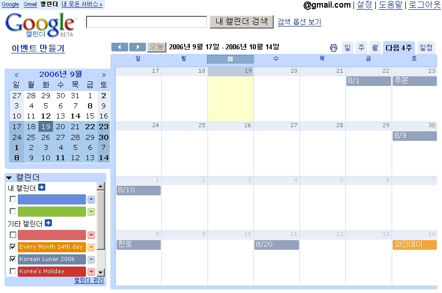

 이상하게 오늘 오전에 구글 캘린더에 접속이 안되었다. 그러다가 오후에 접속해보니 뭔가가 글자가 커지고 이상하다는 느낌이 들어서 살펴보는데, 이런... 한글이 나온다!! 한글 내용이 보이는게 아니라, 메뉴가 한글로 바뀌었다. 드디어 구글 캘린더 한글판!!!
사실 딱히 어려운 영어단어가 없고, 한글 내용 입력도 잘되어서 잘 쓰고 있었는데, 그래도 한글로 나오니 무척 편리하다 ^^
아직 많이 써본 것은 아니지만 그래도 이제 한국 관련 이벤트들이 좀 강화되려나. 기대 중~~ 구글이 요새 한국에 신경 좀 쓴다더니 맘에 쏙 든다~~ ㅎㅎ

ps : 2006-09-26 한글에 맞게 CSS 가 적용되기 시작했다. 이제 한글판도 '너무 큰 글꼴' 을 쓰지 않는다.

