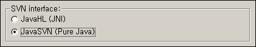

 eclipse 에서는 기본적으로 [subclipse](http://subclipse.tigris.org/) 를 통해 SVN(Subversion) 을 관리할 수 있다.
Help -&gt; Software Updates -&gt; Find and Install -&gt; Search for new features to install 메뉴에서 http://subclipse.tigris.org/update\_1.0.x 를 추가함으로써 subclipse 플러그인을 설치할 수 있다.
하지만 이 설치 후 SVN Repository Exploring 에서 New -&gt; Repository Location 을 통해 소스 저장소를 등록하는데 실제로 해보면 svn:// 프로토콜을 이용하는 저장소는 잘 등록이 되나 svn+ssh:// 프로토콜을 이용하는 저장소는 "org.tigris.subversion.javahl.ClientException", "svn: Can't create tunnel" 오류를 일으키며 제대로 등록이 되지 않는다.
이 경우 제대로 등록하기 위해서는
Window -&gt; Preferences -&gt; Team -&gt; SVN 메뉴에서,
SVN interface : 를 JavaHL (JNI) 로 설정되어 있는 것을 JavaSVN (Pure Java) 로 바꾼다. 그런 후 다시 svn+ssh:// 프로토콜을 이용하는 저장소를 등록해보자. 그럼 id, password 를 묻는 창이 뜨면서 제대로 svn+ssh:// 저장소를 등록할 수 있을 것이다.

