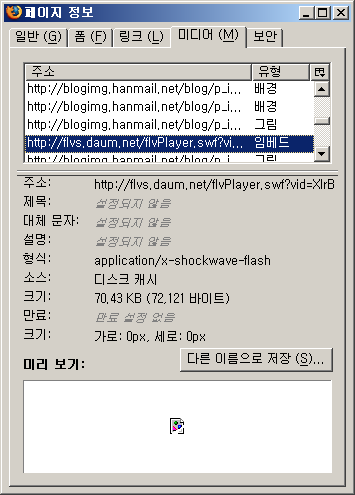

 이미 flv 플레이어로 재생하는 동영상 사이트들의 flv 파일을 다운받는게 많이 알려진 요즘 이런 방법을 알린다고 해도 큰 문제는 될게 없다는 생각에 올려본다. 만약 문제가 있다면 얼른 이 포스트를 닫도록 하겠음~
내 블로그에 다음 동영상을 보여주고 싶은데(아마 url 이나 object, embed tag 를 일부러 숨긴 페이지들도 다 될거라 예상한다) url 을 찾기가 힘들다. 혹은 프레임으로 나눠져있어서 따라가기가 힘들다. 이럴 경우 다음과 같이 간단히 url 을 얻을 수 있다.
원하는 페이지를 열자. 예를 들어 다음 동영상에서 해당 동영상을 볼 수 있는 페이지로 가자. 그런 후 파이어폭스 메뉴에서, 도구 -&gt; 페이지 정보 를 누르자. 그러면 다이얼로그가 하나 뜨는데 여기서 '미디어' 탭을 선택하자.
그 중 유형이 '임베드' 인 것을 찾으면 해당 url 을 얻을 수 있다. 물론 동영상 말고도 '임베드' 인 종류가 있을 수 있으므로 그 판단은 알아서(꽤 쉽다) 하도록 하자.

여기서 얻은 url 을 태터툴즈에서 '미디어 삽입' 으로 url 을 넣어주면 간단히 완성.

