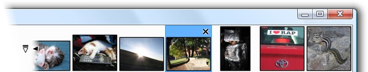

 드디어 Paint.NET 3.0 이 릴리즈되었다. 공식 홈페이지에서 2007년 1월 26일에 릴리즈되었으므로 조금은 시간이 지난 것 같다. 3.0 부터는 한글이 기본적으로 지원된다. C\# 으로 프로그래밍되었기 때문에 유니코드의 지원은 원래부터 되었었다.
 윈도우용 이미지 편집 오픈소스가 그나마 GIMP 가 대세였는데 어느 새 Paint.NET 이 꽤 괄목할 만한 성장을 보여주고 있다. 한 때는 이 프로그램이 Vista 의 그림판으로 들어가지 않을까하는 루머도 있었으나 실제로는 그렇지 않았다.
 Paint.NET 은 간단히 말해서 C\# 으로 만들어진 포토샵을 겨냥한 오픈소스 프로그램이다. 현재 큰 틀은 포토샵을 많이 따라갔으나 세부적인 기능은 아직 포토샵에 훨씬 못 미치고, GIMP 에도 많이 밀리는 상황이다. 예를 들면 간단한 '문지르기' 기능이 없다. 물론 blur 필터를 쓰면 가능하기는 하나, 마우스나 타블렛을 이용하여 원하는 곳을 문지리는 그 느낌을 살리기 힘들다. 이와 비슷하게 꼭 필요하지는 않다고 생각할 수 있는 세세한 기능들이 아직은 구현이 모자라다.
 하지만 이와 반대로 후발 주자인만큼 재미있는 기능들이 추가되고 있다. 대표적으로 여러 파일을 열었을 때의 탭 기능이다. 이미지 편집 프로그램이라는 특색을 살린 탭을 구현하고 있는데 아래의 스크린샷과 같은 thumbnail 탭 기능을 구현하고 있다.

 화면의 오른쪽 위에 현재 열린 파일들을 보여주어 꽤 좋은 기능으로 평가된다.
 그리고 3.0 베타때부터 최신 버젼을 자동으로 체크해주는 기능이 포함되었다.
 윈도우에서 이미지 편집이 필요한데 GIMP 는 인터페이스가 어렵고, 포토샵과 비슷한 느낌의 프로그램이 필요하다면 Paint.NET 이 좋은 대안이 될 것이다.
 - [Paint.NET 3.0 릴리즈를 알리는 웹초보님의 링크](http://www.choboweb.com/2007/01/29/%ed%95%9c%ea%b8%80%ed%8c%90-paintnet-30%ec%9d%b4-%eb%82%98%ec%99%94%eb%84%a4%ec%9a%94/)

