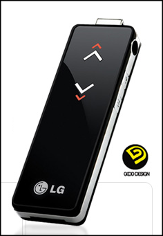

 얼마전 형이 설 선물로 LG-UP3FLAT 라는 USB 메모리 겸 mp3 플레이어를 받아서 나에게 선물해줬다. 그런데 마침 내 노트북에서는 우분투가 깔려있었는데 라이센스 문제로 리눅스에서는 mp3 가 잘 플레이되지 않는 다는 얘기가 있어서 혹시나해서 플레이를 했더니 역시나 토템, 리듬박스에서 플레이가 안되는 것이었다. 그래서 Amarok 이 얼핏 생각나서 Amarok 을 설치했다.
 근데 재미있는 것이,  Amarok 을 설치한 후에 mp3 코덱이 없자 알아서 설치할까를 묻더니 '프로그램 추가/제거' 를 띄우더니 코딕을 설치 해줬다. 이정도까지 편리해졌다니!! 지가 무슨 곰플레이어도 아니고 코덱을 알아서 설치해주는 고객감동을 선사해주다니...
 아직 divx 동영상을 플레이해본 건 아니지만 혹시 다른 동영상 플레이어에서도 이런 코덱 자동 설치등을 지원해주려나... 시간나면 테스트를 해보아야겠다 :)
ps : 선물받은 기념으로 제품 사진;;

