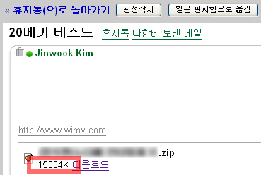

 gmail 의 3GB 에 가까운 용량을 요즘은 파일 보관 장소로도 활용하고 있다. 기존에 드림위즈의 웹디스크에 있던 자료도 첨부 파일 형태로 메일을 보내어 보관하는데, 얼마전까지는 10MB 의 용량 제한을 가지고 있었으나, 최근 20MB 로 첨부 파일의 용량을 늘였다([구글 블로그 포스트](http://googleblog.blogspot.com/2007/05/bigger-attachments-in-gmail.html))
 이제 좀 더 여유롭게 gmail 을 파일 저장소로 쓸 수 있을 듯 하다. Thanks google!!

