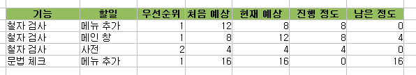

1. 스프레드시트를 이용해서 관리하라.
2. 단순하게 만들라.
\*. 작업에 대해 '처음 예측', '현재 예측', '진행', '남은양' 을 만들어 계속 업데이트 하라.
3. 각 기능은 여러개의 task 를 포함해야한다. task 목록을 작성하자.
4. 담당 프로그래머가 제대로 된 일정을 짤 수 있다.
5. task 를 세부적으로 나눠라
6. 초기 예측과 현재 예측을 동시에 유지하라.
7. 경과 열은 매일 갱신하라.
8. 일정에 휴가나 휴일 같은 항목을 넣어라.
9. 일정에 디버깅 시간을 넣어라.
10. 일정에 통합 시간을 넣어라.
11. 일정에 여유 기간을 두어라.
\*. 일은 생각보다 오래 걸린다. 예측 시간에 비해 현재 예측이 길어질 경우가 많으므로 그 때 이 여유 기간을 써라.
12. 관리자가 프로그래머에게 일정을 단축하도록 절대 강요하지 못하게 하라.
13. 일정은 장난감 블록과도 같다.
\*. 일정에 따라 기능을 쳐내든지 발표를 연기하라. 기능을 쳐내는 것을 두려워하지 마라.
일정을 제대로 잡는 것도 연습이 필요하고, 그것을 정리하는 것이 필요하다라... 해볼까나...
