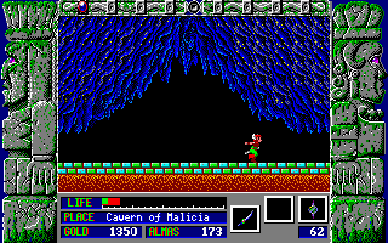

 멤버십의 자리를 정리하다가 문득 시디를 정리하게 되었는데, 'Game Collection 2' 라는 시디가 있었다.
 뭐가 들어있을까하며서 열어보니 상당히 반가운 것들이 들어있었다. 아마 한 15년쯤 된 자료들이라고 생각된다.
- 기계전사 109
- DDR
- DESCENT
- DOOM2
- Heretic
- MKII
- OMF(One Must Fall)
- PrincessMaker2
- Street Fighter Zero 2
- TIE Fighter
- 툼레이더4
- 4DBox
- 텐더클 최후의 날
- 플래시백
- 고블린2
- PREHISTORY2(고인돌2)
- 랩터
- 젤리아드(!!!)
 몇가지만 언급해보면,
 기계전사 109 는 어린 시절에 상당히 충격적으로 읽었던 만화책이다.(이
때도 만화책 스캔이 있었는듯;;; ) 어머니가 사이보그로 재탄생(죽어서)되었고, 어머니가 사이보그의 해방을 위한 전사가 된 내용이다. 아직도 네이버에서 검색해보면 꽤 인상깊은 작품으로 인식되고 있는 듯하다.
 Doom2 는 device 로 압축을 푸는 원본 파일... -\_-;;;
 MK2 는 모탈컴뱃2의 PC판
 OMF 는 상당히 재미있게 했던 로봇 격투 게임이다. 대전 게임에서 RPG 요소를 넣어서 강화시키고 그런게 있고, MK 를 따라해서 finish 로 상대 로봇을 완전히 박살해는 요소가 재미있었다. 이 게임으로 하이텔에 [공략집](http://www.wimy.com/wiki/wiki.php/GameReviewOMF)을 올린 기억도 난다. 다행히 지금도 내 홈페이지에 자료가 있다. ㅎㅎ
 프린세스 메이커2 는 워낙 유명한 게임이라서 통과~ 참고로 내 여자 친구가 유일하게 밤새워서 해 본 게임이라는 ㅋㅋ
 4DBox 라는 게임은 어쩌면 둠 시리즈보다 먼저 3D 를 게임에 구현한 것이 아닐까하는 기억이 남아있는 복싱 게임이다. 타이밍을 맞춰서 조작하면 일보의 뎀프시 롤처럼 무한 훅이 나가서 상대방을 몰아붙이던 기억이 난다.
 랩터는 DOS 시절에 상당히 재미있는 슈팅 게임으로 기억하는데 자료가 CRC 에러로 날아갔다 ㅠ.ㅜ
 젤리아드는... 내가 컴퓨터용 게임에 처음으로 빠지게 만들었던 게임이다. RPG 형식의 사이드뷰 형태의 게임이었는데, 내용은 공주를 구하러가는 떠돌이 용사쯤되고, 각 스테이지 마다의 보스전, 그리고 각 스테이지 마다 (마을 + 미궁) 의 형식이었는데, 스테이지를 진행할 때마다 새로운 스테이지의 미궁에서 특정 문에 들어가면 잠깐 이전 스테이지의 미궁으로 가고, 새로운 스테이지에서 얻은 아이템으로 이전 미궁에서 못 가던 길을 가던 재미가 있었다. 정말 명작으로 꼽히는 게임.... 찾아보니 [위키페디아에 페이지](http://en.wikipedia.org/wiki/Zeliard)도 있다.

 시간나면 위의 것들을 한번 훑어볼 건데... 과연 실행이 될까? ㅎㅎ
 인터넷을 뒤져보니 아직 고전 게임을 다운받을 수 있는 곳이 있었다.
<a href="http://adcr.naver.com/adcr?x=+LCOsRXFxzlioXYLw+R+Yf///w==nFKxsK6CzvJu0JH12wfRVfxcBxIvX+LOWct4C9K1tkmfKEpMeno0aLPAZfBqVhZvX8JFBJIhMvje0UUd/1VIjIpJz/A4CPqT1DTSdA7Xsy5gLuHUjaGaz6774lM7dZ7IaqmqFneQS2b4dRu4A8Ds9ih76j/Qz8GGpUxQ5QZh7q6dmDZG54b86Y7eBTZrcmgCfOTSiD1putLwAxA+ncGjEaS3OUFWXiMJEJTHfSo3qARQ=&amp;p=1" class="url"> http://free.gemmir.com</a>
 http://lsibbs.wowdns.com/cgi-bin/main.cgi?board=games
 위에서 300여개의 고전게임을~~

