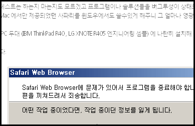
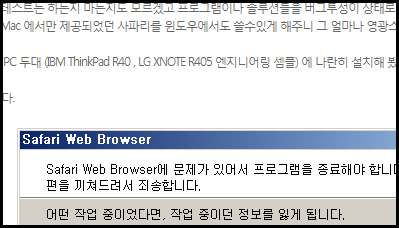

 위의 이미지는 웹 서핑 중 만나게 되는 여러 블로그 중 한 곳이다. 위의 그림을 자세히 보면 Safari Web Browser 라는 스크린샷 안의 글자는 잘 보이지만 본문인 윗부분의 글꼴은 선이 흐릿한 것을 볼 수 있다. 이렇게 본문 글꼴의 선이 흐릿한 블로그들을 요즘은 종종 보게 된다. 특히 내 컴퓨터에서만 -\_-;
 이 현상이 '맑은고딕' 때문인 거 같은데, 블로그들을 돌아다니다보면, 이상하게 눈이 아프게 읽기 힘든 블로그들이 있다. CSS 를 보니, font-family 가 맑은 고딕으로 되어 있던데, 내 컴퓨터는 비스타 환경이 아닌 XP 에서, Office2007 이 깔린 환경이다. Office2007 을 깔면 '맑은 고딕' 폰트가 설치되는데, 폰트가 없어서 이상하게 출력되는건 아닌거 같고... 여튼 읽기 어렵고 눈이 아프다.
 비스타에서는 폰트에 안티-알리아싱이 된 거 같은데, 이게 생각보다 정말 눈에 잘 안 들어온다. 아마 좀더 큰 폰트에서는 미려하게 보일지 몰라도, 작은 크기의 폰트에서는 선의 경계가 뚜렷하지 않아서, 복잡한 '를' 같은 글자를 보면, 블로그 운영자들은 이 현상을 알고 있을까? XP 환경에서 '맑은 고딕'이 설치된 환경에서 정말 읽기 힘든 글꼴로 보인다는 것을...
ps : wizmusa 님이 달아주신 댓글을 참고하여 [\[여기\]](http://www.microsoft.com/typography/cleartype/tuner/Step1.aspx) 에 가서 설정을 해보았더니 다음과 같이 훨씬 잘 보이는 글꼴로 볼 수 있었다. wizmusa 님 감사합니다~ :)

