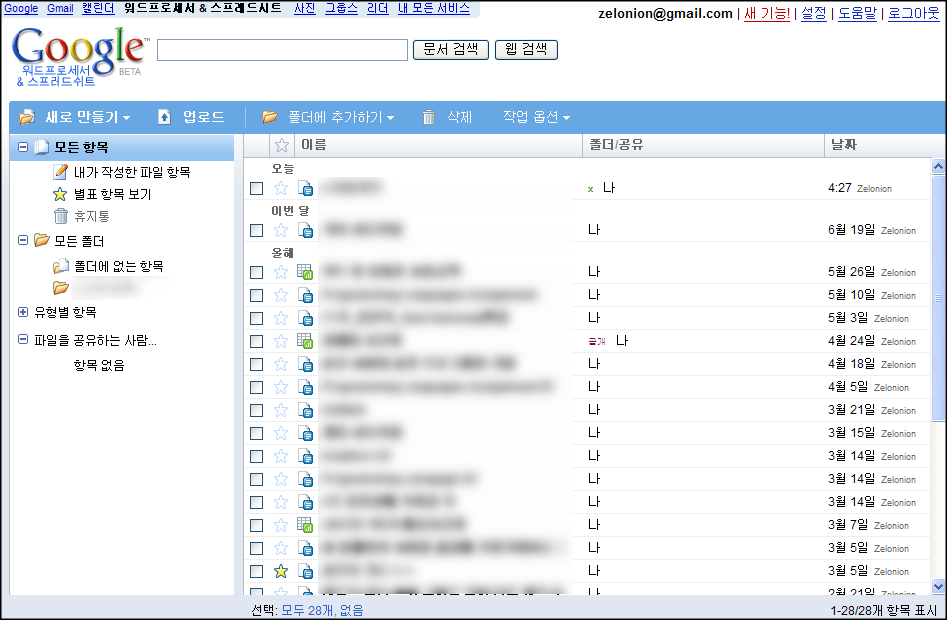

 Google 의 온라인 문서 및 스프레드시트 툴인 Google Docs(Google 문서 및 스프레드시트)의 UI 가 얼마전 업데이트 되었다. 메타 블로그의 인기글 목록에 없어서 생각보다 많은 사람들이 아직 온라인 문서 툴을 쓰지 않는다는 생각이 들기도 한다.

 눈에 확띄는 것은 기존에는 최근에 사용하지 않은 문서는 기본적으로 보이지 않는데, 최근에 사용한 문서를 위에 배치하면서도 최근에 사용하지 않은 문서도 보여주게 UI 가 변경되었다. 그리고 기존 구글의 단순한 텍스트 배치에서 조금은 벗어나 UI 를 부드럽게 꾸몄다는 느낌을 준다. 또한 기존의 tag 로 분류되던 것을 폴더라는 개념을 적용하여 좀더 초보자의 이해를 도우려고 했다는 느낌도 든다.
 http://www.google.com/google-d-s/intl/ko/whatsnew.html
 에서 설명하는 새로운 기능에는 폴더 기능 외에도, 다양한 단축키들이 추가되었으며, 초대 기능이 쉬워졌고, 히브리어 및 아랍어 사용자들을 위해 오른쪽에서 왼쪽으로 입력할 수 있게 되었다고 한다.

