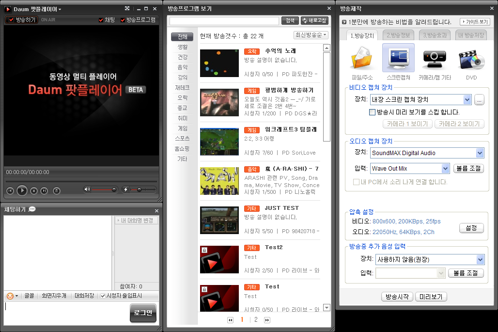

 요즘 다음은 UCC 를 한창 밀고 있다. 그 중 동영상을 포털에 올려서 공유하는게 대부분이고, 대세지만 이제는 실시간으로 개인 동영상 방송을 하고 있다. 바로 팟플레이어라는 것이다. 다음의 URL 에서 다운받을 수 있다.
 http://tvpot.daum.net/live/LiveDownload.do

 위와 같은 화면의 플레이어가 작동되면서 다른 사람이 방송중인 채널을 선택하여 방송을 볼 수 있다. 같은 방송을 보는 사람들과 채팅도 지원되며, 오른쪽에 있는 방송하기 메뉴를 통해서 정말 쉽게 자신의 방송을 플레이할 수도 있다.
 메뉴나 기타 옵션들을 봐서는 곰플레이어와 제휴하지 않았나 싶은 생각이 든다(그만큼 동영상 플레이어의 기능도 충실하다) 그리고 실제로 비슷한 개인 방송 서비스를 하고 있는, [나우콤](http://www.nowcom.co.kr/)에서 서비스 중인 [아프리카](http://afreeca.pdbox.co.kr/)와 거의 비슷한 화면 구성이기도 하다. 단, 아프리카는 웹에 좀더 치중한 반면, 팟플레이어는 웹이 없이도 실행할 수 있는 플레이어다.
 과연 이런 개인 동영상 방송 시스템이 얼마만큼 유저들이 사용해줄지는 모르겠지만, 일단 시간 보내기는 정말 좋다. 특히 개인 게임 화면을 방송하는 채널은 상당히 흥미롭게 다른 사람이 하는 플레이를 지켜볼 수 있다. 그리고 개인적으로 좋아하는 철권, 소울칼리버 같은 경우 특정 모 오락실에서(어떻게 한건지는 몰라도) 24시간 방송을 해주고 있다. 즉, 현재 오락실에서 벌어지는 VERSUS 게임을 방송해준다(솔직히 이거 때문에 포스팅하는거다;; ) 그리고 요새 한창 하고 있는 카오스 게임도 자신의 게임 화면을 방송하는 것이 몇몇 있다.
 솔직히 UCC 동영상들을 사이트 다니면서 보는 것도 재미있지만, 현재 생성되고 있는 생생한 라이브 방송을 볼 수 있다는 것도 상당한 재미로 다가온다. 집에 TV 가 없고 인터넷만 있다면 케이블 채널을 본다는 기분(진짜 24시간 철권 채널!!!) 으로 설치해보시길~

